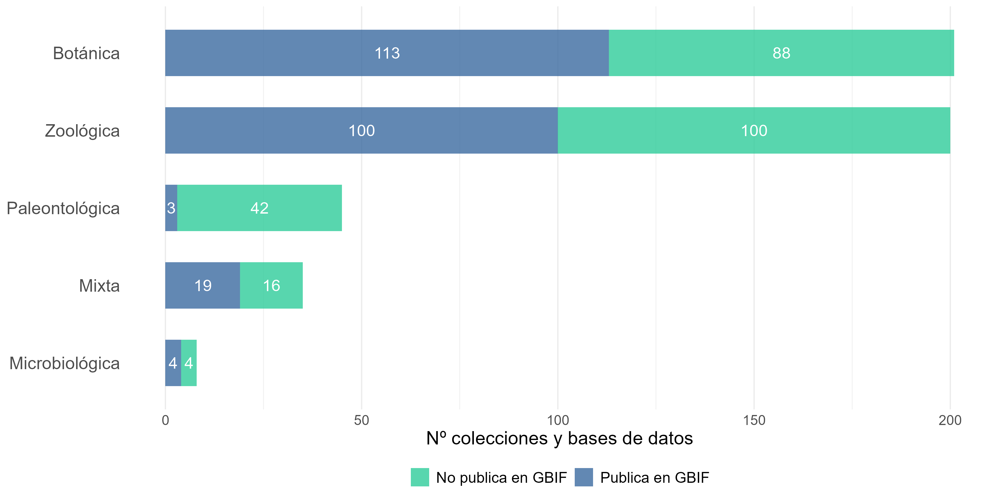
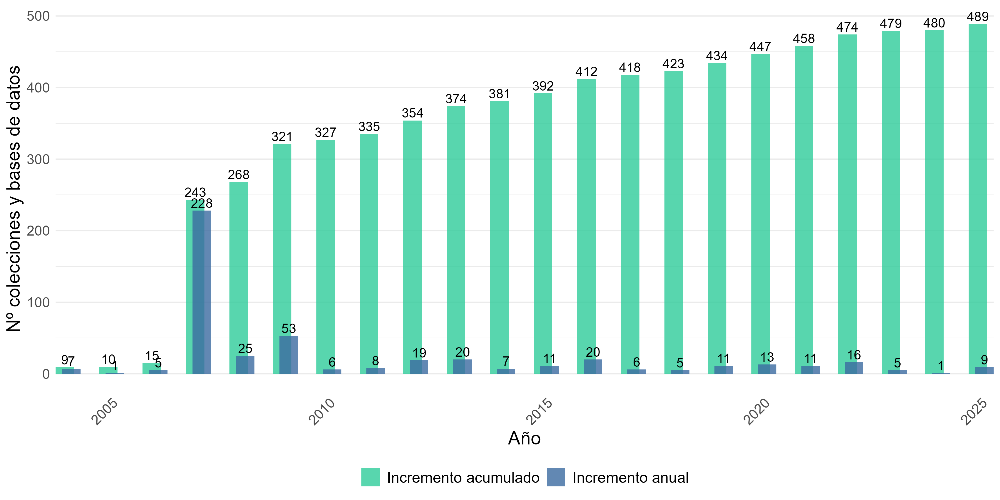
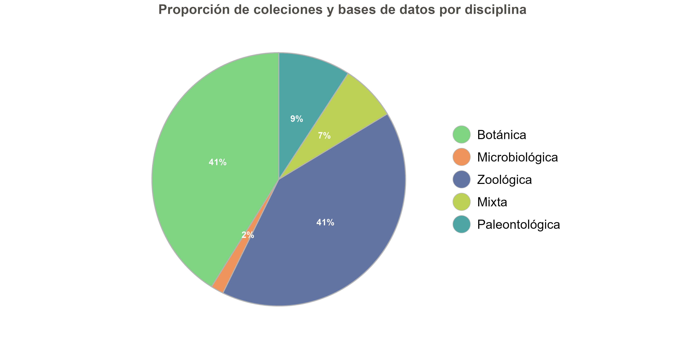
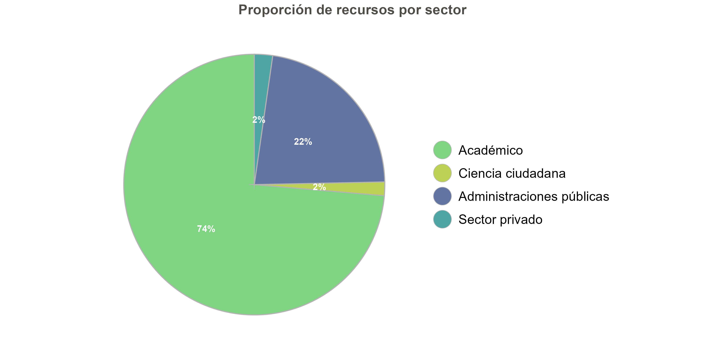
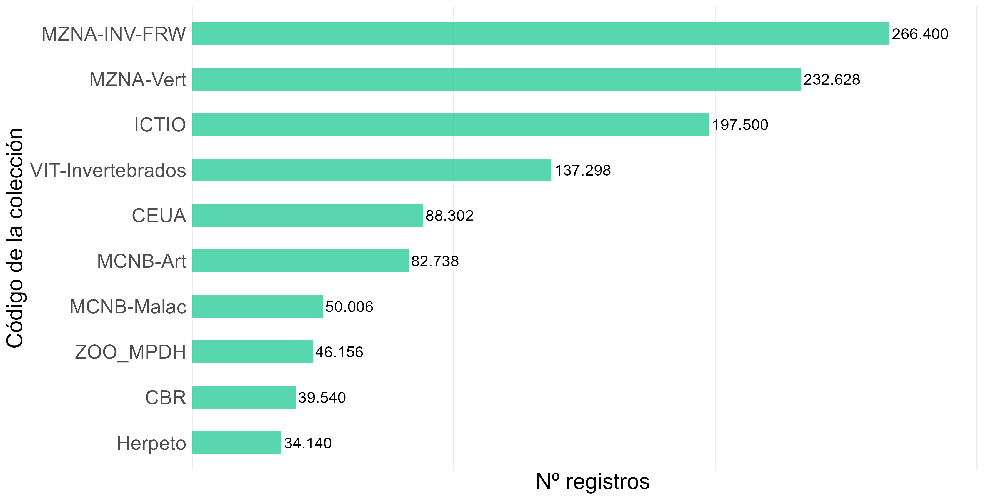
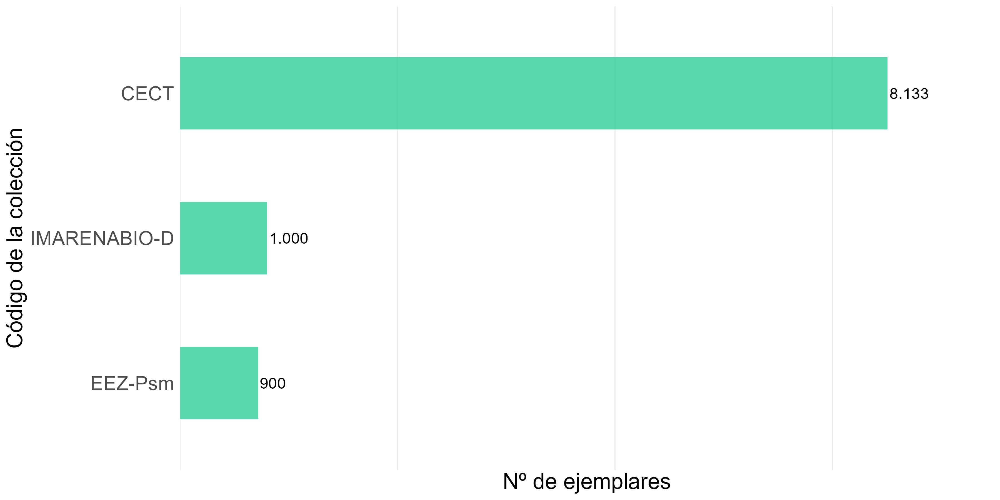
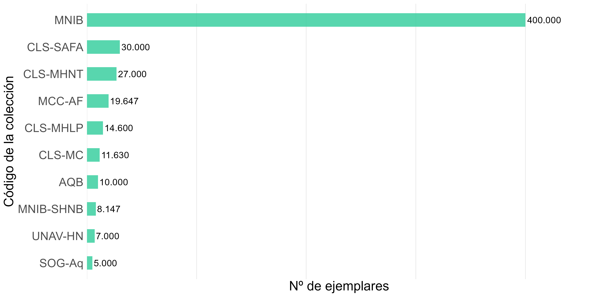
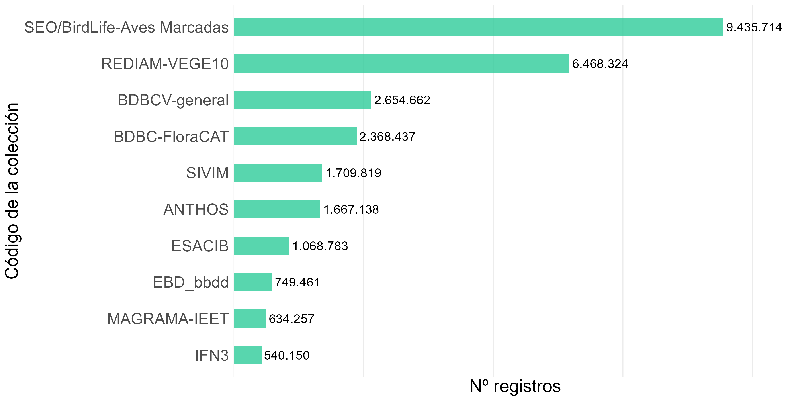
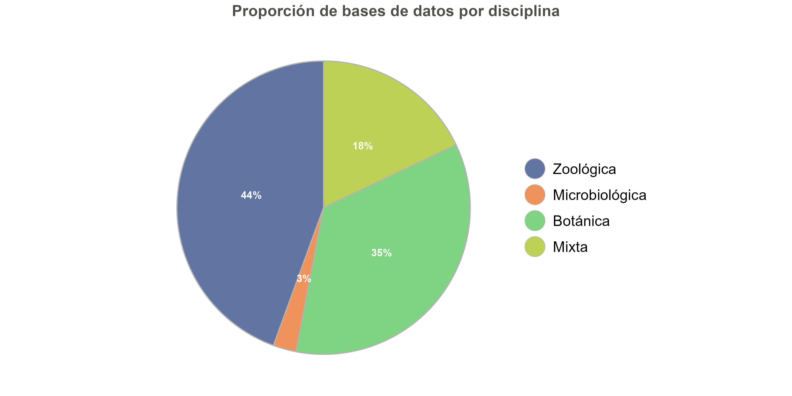

# Dashboard estático de métricas de MetaGES

## Introducción

Esta vignette muestra distintas tablas y gráficas para mostrar métricas
de MetaGES, usando el paquete `metagesToolkit` mediante las siguientes
[funciones](https://gbifes.github.io/metages-toolkit/reference/index.md)
.

## Métricas básicas de MetaGES

## Entidades

### Número de entidades según su estado de publicacion

## Colecciones y Bases de datos

### Número de colecciones y bases de datos según su estado de publicacion

### Evolución del número de colecciones y bases de datos registradas por año

### Proporción de colecciones y bases de datos por disciplina

## Recursos (Juegos de datos)

### Proporción de recursos por sector

## Registros

### Proporción de registros por sector

### Evolución del número de registros por basisOfRecord

### Evolución (logarítmica) del número de registros por basisOfRecord

## Colecciones biológicas

### Número de ejemplares de las mayores colecciones botánicas

### Número de ejemplares de las mayores colecciones botánicas de plantas

### Número de ejemplares de las mayores colecciones botánicas de algas

### Número de ejemplares de las mayores colecciones botánicas de hongos y líquenes

### Número de ejemplares de las mayores colecciones botánicas mixtas

### Número de ejemplares de las mayores colecciones zoológicas

### Número de ejemplares de las mayores colecciones zoológicas de invertebrados

### Número de ejemplares de las mayores colecciones zoológicas de vertebrados

### Número de ejemplares de las mayores colecciones zoológicas de invertebrados y vertebrados

### Número de ejemplares de las mayores colecciones microbiológicas

### Número de ejemplares de las mayores colecciones paleontológicas

### Número de ejemplares de las mayores colecciones mixtas

## Bases de datos

### Número de registros de las mayores bases de datos

### Proporción de bases de datos por disciplina

