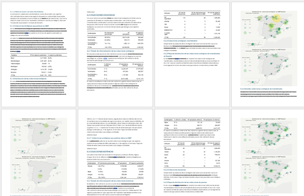
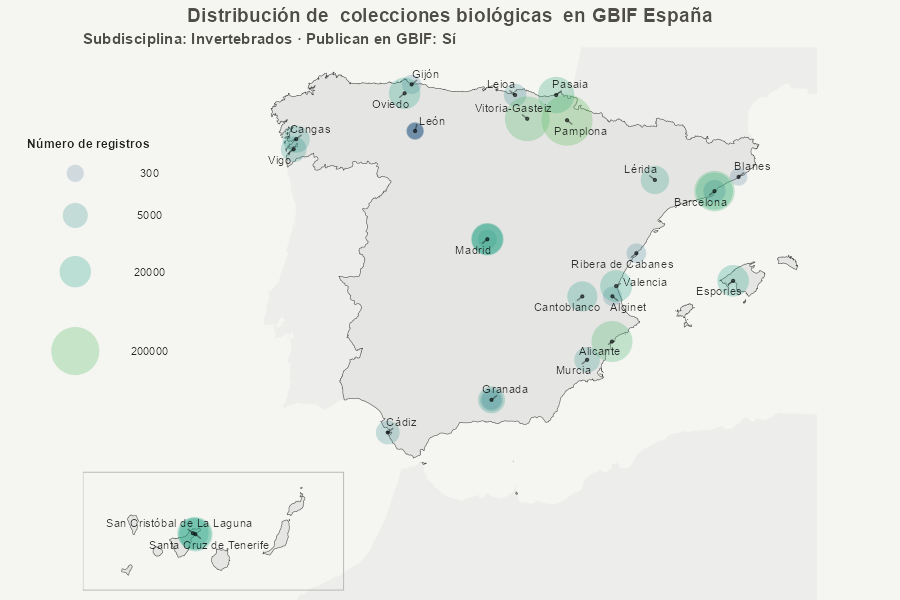
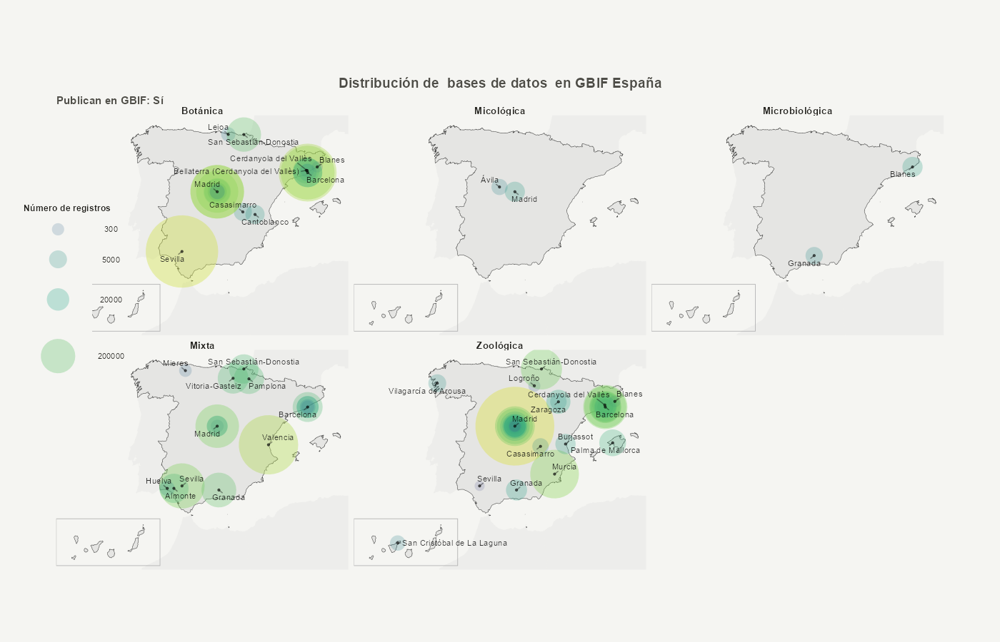

# metagesToolkit

Repositorio de uso interno para leer, analizar y actualizar el Registro
de Instituciones, colecciones y bases de datos de biodiversidad de GBIF
España

- [Descripción](#descripci%C3%B3n)
- [Instalación](#instalaci%C3%B3n)
- [Uso](#uso)
  - [Generar informe](#generar-informe)
  - [Crear mapas](#crear-mapas)
- [Estructura del repositorio](#estructura-del-repositorio)

------------------------------------------------------------------------

## Descripción

Este toolkit de uso interno proporciona un conjunto de herramientas en R
y SQL (incluyendo el paquete de R `metagesToolkit`) para gestionar y
analizar `MetaGES`, la base de datos del **[Registro de Colecciones de
GBIF.ES](https://gbif.es/registro-colecciones/)**.

El paquete permite:

- 🔍 Extraer información directamente desde la base de datos MetaGES,
- 📊 Procesar y resumir los datos (incluyendo generación de mapas
  temáticos),
- 📝 Producir informes técnicos reproducibles en formato Word.

El paquete asume un entorno de trabajo controlado y acceso autorizado a
MetaGES. No está pensado como paquete de uso general.

------------------------------------------------------------------------

## Instalación

El paquete se instala directamente desde GitHub:

``` r
# install.packages("remotes")
remotes::install_github("GBIFes/metages-toolkit")

# Para desarrollo local del paquete se recomienda utilizar `devtools`, pero no es necesario para su uso normal.
# install.packages("devtools")
# devtools::install_github("GBIFes/metages-toolkit")
```

------------------------------------------------------------------------

## Uso

Actualmente, el flujo principal del paquete se articula en torno a la
función
[`render_informe()`](https://gbifes.github.io/metages-toolkit/reference/render_informe.md),
que orquesta internamente la conexión a MetaGES, la extracción de datos,
el procesamiento, la creación de mapas y la generación de un informe
final como archivo `.docx`.

El paquete expone además varias funciones útiles para la exploración
visual de los datos y el post-procesado del informe. Sin embargo, para
usar estas funciones ***es imprescindible tener drivers instalados y
credenciales adecuadas para acceder a MetaGES***  
  

👉 **Consulta el artículo [Guia de uso de metagesToolkit -
USUARIOS](https://gbifes.github.io/metages-toolkit/articles/guia-uso-usr.html)**
para acceder a todas las funcionalidades del paquete.

------------------------------------------------------------------------

### Generar informe

Genera un archivo `.docx` en el `working directory` actual basado en
[Informe
Quarto](https://github.com/GBIFes/metages-toolkit/blob/main/inst/reports/informe.qmd).  
El informe contiene información detallada sobre el contenido de la base
de datos MetaGES.

👉 **Consulta el artículo [Generacion del Informe de Colecciones con
metagesToolkit](https://gbifes.github.io/metages-toolkit/articles/guia-uso-usr.html#generacion-del-informe-de-colecciones)**

``` r
render_informe()
```



------------------------------------------------------------------------

### Crear mapas

Genera un mapa a partir de los datos procesados.  
Permite filtrar por `tipo_coleccion`, `disciplina`, `subdisciplina` y si
`publican` en GBIF o no. Además, permite hacer un `facet` con cualquier
columna de la tabla de datos.

👉 **Consulta el artículo [Creación de mapas de colecciones con
metagesToolkit](https://gbifes.github.io/metages-toolkit/articles/crear-mapas.html)**

- ***Mapa de las colecciones de invertebrados publicadoras***

``` r
crear_mapa_simple(tipo_coleccion = "coleccion",
                          subdisciplina = "Invertebrados", 
                          publican = TRUE)$plot
```



- ***Mapa de las bases de datos publicadoras faceteado por disciplina***

``` r
crear_mapa_simple(tipo_coleccion = "base de datos",
                          facet = "disciplina_def",
                          publican = TRUE)$plot                       
```



------------------------------------------------------------------------

## Estructura del repositorio

El repositorio combina código del paquete R con recursos auxiliares
necesarios para la exploración de MetaGES y para la generación del
informe.

    metages-toolkit/
    ├── codecov.yml
    ├── DESCRIPTION                                     : Descripción del paquete de R metagesToolkit.
    ├── inst/
    │   ├── reports/                                    : Materiales para generar el informe de colecciones.
    │   │   ├── assets/                                 : Imágenes y plantillas para el informe.
    │   │   │   ├── images/
    │   │   │   │   ├── external/
    │   │   │   │   │
    │   │   │   │   ├── generated/                      : Contiene imagenes autogeneradas por inst/scripts/actualizar_mapas_vignettes.R para ser usadas por informe.qmd
    │   │   │   │   │
    │   │   │   │   └── logos/
    │   │   │   │
    │   │   │   └── templates/
    │   │   │       └── reference.docx
    │   │   │
    │   │   ├── data/                                   : Contiene carpetas autogeneradas por inst/scripts/actualizar_mapas_vignettes.R
    │   │   │   ├── mapas/                              : Contiene objetos .rds con la tabla de datos que genera cada mapa del informe y las vignettes
    │   │   │   └── vistas_sql/                         : Contiene objetos .rds con la tabla de datos que genera cada vista SQL de MetaGES
    │   │   │
    │   │   └── informe.qmd                             : Documento Quarto que genera el informe de colecciones usando las funciones del paquete de R metagesToolkit.
    │   └── scripts/                                    : R Scripts de apoyo a la gestión de la base de datos MetaGES, del paquete de R metagesToolkit y para almacenar funciones que aun no han sido añadidas al paquete de R.
    │       ├── actualizar_SQL_scripts.R
    │       ├── actualizar_Renviron.R
    │       ├── usage.R
    │       ├── ...
    │
    ├── LICENSE                                         : Licencia de uso del repositorio.
    ├── man/                                            : Documentación de las funciones del paquete de R.
    │
    ├── metagesToolkit.Rproj                            : Archivo del proyecto de RStudio.
    ├── NAMESPACE                                       : Define que dependencias se importan y exportan al usar el paquete de R.
    ├── R/                                              : Funciones que forman parte del paquete de R.
    │   ├── conectar_metages.R                          : Función para conectar R a MetaGES
    │   ├── extraer_colecciones_mapa.R                  : Función para extraer datos de colecciones de MetaGES. Usa conectar_metages.R
    │   ├── crear_mapa.R                                : Funcion compleja para crear mapas con los datos de extraer_colecciones_mapa.R
    │   ├── crear_mapa_simple.R                         : Wrapper simplificado de crear_mapa.R. Opción recomendada para crear mapas.
    │   ├── render_informe.R                            : Crea una carpeta con el contenido del output de informe.qmd
    │   ├── insertar_tablas_colecciones.R               : Añade las grandes tablas finales al output de render_informe.R, generando informe_con_tablas_colecciones.docx
    │   ├── ...
    │
    ├── README.md                                       : Descripción del repositorio.
    ├── sql/                                            : Scripts generados automaticamente por actualizar_SQL_scripts.R para guardar la documentacion de las Vistas y otros Scripts de MetaGES.
    │   ├── LEEME
    │   └── scripts/
    │       ├── colecciones_per_estado_publicacion.sql
    │       ├── colecciones_informatizacion_ejemplares.sql
    │       ├── colecciones_per_anno.sql
    │       ├── contactos_entidades.sql
    │       ├── ...
    │
    ├── vignettes/
    │   └── crear-mapas.Rmd                             : Markdown para crear un articulo en github pages (https://gbifes.github.io/metages-toolkit/articles/crear-mapas.html)
    │
    ├── docs/                                           : Documentos necesarios para crear la github page del repo (https://gbifes.github.io/metages-toolkit/index.html)
    │
    ├── pkgdown/
    │   └── assets/pkgnet-report.hmtl                   : Análisis de la arquitectura de metagesToolkit realizado por inst/scripts/actualizar_pkgnet_arquitectura.R
    │
    └── tests/                                          : Tests para las funciones del paquete de R metagesToolkit
        ├── testthat/
        │
        └── testthat.R
