::: callout-note
Este informe está pensado para **generar automáticamente mapas y tablas** a partir del Registro (Metages/WordPress) siguiendo una estructura similar a los informes institucionales de GBIF España.
:::

# Portada


{width="20%"}
{width="20%"}
{width="20%"}

\newpage
# Resumen ejecutivo

En esta sección se presenta una síntesis de los principales resultados del Registro, con especial atención a:

-   número de colecciones / bases de datos con registros (\>0)
-   distribución espacial
-   principales focos (ciudades) según nº de ejemplares/registros
-   publicación en GBIF

```{r}
#| label: setup
#| include: false


# Paquete del proyecto (cuando ya sea paquete)
#devtools::load_all(here::here())
library(metagesToolkit)

library(dplyr)
library(ggplot2)
library(sf)
library(DBI)
library(flextable)
library(odbc)
library(scales)
library(ssh)
library(giscoR, quietly = TRUE, warn.conflicts = FALSE)
library(ggrepel)
library(forcats)
library(processx)


# --------------------------------------------------
# 1. Dominio de datos (una sola vez)
# --------------------------------------------------
dom <- extraer_colecciones_mapa(odbc_driver = params$odbc_driver)
data <- dom$data

# --------------------------------------------------
# 2. Basemap (una sola vez)
# --------------------------------------------------
basemap <- get_basemap_es()

# --------------------------------------------------
# 3. Escala global del informe
# --------------------------------------------------
legend_params <- compute_legend_params(
  data,
  probs = c(.1, .4, .65, .9)
)

# --------------------------------------------------
# Utilidad tablas
# --------------------------------------------------
# Utilidad: tabla bonita estilo informe (sin colores fijos; el estilo lo debe dar la plantilla DOCX)
ft_tbl <- function(x, caption = NULL) {
  ft <- flextable::flextable(x)
  ft <- flextable::autofit(ft)
  ft <- flextable::set_table_properties(
    ft,
    width = 1,
    layout = "autofit"
  )
  if (!is.null(caption)) {
    ft <- flextable::set_caption(ft, caption)
  }
  ft
}
```

```{r}
#| label: datos
#| include: false


# SQL Views
con <- conectar_metages(
  driver = params$odbc_driver
)$con


# otras metricas
n_edicion_informe_actual <- "septima"
n_edicion_informe_anterior <- "sexta"
anno_actual <- format(Sys.Date(), "%Y")
anno_informe_anterior <- 2019
anno_publi_informe_anterior <- 2021
mes_anno_actual <- format(Sys.Date(), "%B de %Y")
mes_anno_informe_anterior <- "diciembre de 2019"


# data
# Lectura interna
colbd <- readRDS("data/mapas/mapa-total.rds")
reg <- readRDS("data/vistas_sql/registros.rds")

# entidades
n_entidades_actual <- colbd %>% select (institucion_proyecto) %>% distinct() %>% nrow()
n_entidades_actual_pub <- colbd %>% filter(publica_en_gbif == 1) %>% select(institucion_proyecto) %>% distinct() %>% nrow()
n_entidades_actual_pub_x100 <- paste0((n_entidades_actual_pub * 100 / n_entidades_actual) %>% round(1), "%")
n_entidades_informe_anterior <- 229 # Manual
n_entidades_incremento <- n_entidades_actual - n_entidades_informe_anterior
n_entidades_incremento_x100 <- paste0((n_entidades_incremento * 100 / n_entidades_informe_anterior) %>% round(1), "%")


# colbd
n_colbd_actual <- nrow(colbd)
n_colbd_actual_pub <- colbd %>% filter(publica_en_gbif == 1) %>% nrow()
n_colbd_actual_pub_x100 <- paste0((n_colbd_actual_pub * 100 / n_colbd_actual) %>% round(1), "%")
n_colbd_informe_anterior <- 474 # Manual
n_colbd_incremento <- n_colbd_actual - n_colbd_informe_anterior
n_colbd_incremento_x100 <- paste0((n_colbd_incremento * 100 / n_colbd_informe_anterior) %>% round(1), "%")

# colbd_disci
n_colbd_zoo <- colbd %>% filter(disciplina_def == "Zoológica") %>% nrow()
n_colbd_zoo_pub <- colbd %>% filter(disciplina_def == "Zoológica", publica_en_gbif == 1) %>% nrow()

n_colbd_bot <- colbd %>% filter(disciplina_def == "Botánica") %>% nrow()
n_colbd_bot_pub <- colbd %>% filter(disciplina_def == "Botánica", publica_en_gbif == 1) %>% nrow()

n_colbd_micro <- colbd %>% filter(disciplina_def == "Microbiológica") %>% nrow()
n_colbd_micro_pub <- colbd %>% filter(disciplina_def == "Microbiológica", publica_en_gbif == 1) %>% nrow()

n_colbd_paleo <- colbd %>% filter(disciplina_def == "Paleontológica") %>% nrow()
n_colbd_paleo_pub <- colbd %>% filter(disciplina_def == "Paleontológica", publica_en_gbif == 1) %>% nrow()

n_colbd_mix <- colbd %>% filter(disciplina_def == "Mixta") %>% nrow()
n_colbd_mix_pub <- colbd %>% filter(disciplina_def == "Mixta", publica_en_gbif == 1) %>% nrow()

# colbd_subdisci
n_colbd_inv <- colbd %>% filter(disciplina_subtipo_def == "Invertebrados") %>% nrow()
n_colbd_ver <- colbd %>% filter(disciplina_subtipo_def == "Vertebrados") %>% nrow()
n_colbd_invver <- colbd %>% filter(disciplina_subtipo_def == "Invertebrados y vertebrados") %>% nrow()

n_colbd_pla <- colbd %>% filter(disciplina_subtipo_def == "Plantas") %>% nrow()
n_colbd_alg <- colbd %>% filter(disciplina_subtipo_def == "Algas") %>% nrow()
n_colbd_hong <- colbd %>% filter(disciplina_subtipo_def == "Hongos y líquenes") %>% nrow()
n_colbd_botmix <- colbd %>% filter(disciplina_subtipo_def == "Botánicas mixtas") %>% nrow()


# bd
n_bd_actual <- colbd %>% filter(tipo_body == "base de datos") %>% nrow()
n_bd_actual_pub <- colbd %>% filter(tipo_body == "base de datos", publica_en_gbif == 1) %>% nrow()
n_bd_actual_pub_x100 <- paste0((n_bd_actual_pub * 100 / n_bd_actual) %>% round(1), "%")
n_registros_bd_actual <- colbd %>% filter(tipo_body == "base de datos") %>% pull (numberOfRecords) %>% sum(na.rm = T) %>% format(decimal.mark = ",", big.mark = ".")
n_entidades_bd_actual <- colbd %>% filter(tipo_body == "base de datos") %>% select (institucion_proyecto) %>% distinct() %>% nrow()
n_entidades_bd_actual_pub <- colbd %>% filter(tipo_body == "base de datos", publica_en_gbif == 1) %>% select (institucion_proyecto) %>% distinct() %>% nrow()

# col
n_col_actual <- colbd %>% filter(tipo_body == "coleccion") %>% nrow()
n_col_actual_pub <- colbd %>% filter(tipo_body == "coleccion", publica_en_gbif == 1) %>% nrow()
n_col_actual_pub_x100 <- paste0((n_col_actual_pub * 100 / n_col_actual) %>% round(1), "%")
n_registros_col_actual <- colbd %>% filter(tipo_body == "coleccion") %>% pull (numberOfRecords) %>% sum(na.rm = T) %>% format(decimal.mark = ",", big.mark = ".")
n_entidades_col_actual <- colbd %>% filter(tipo_body == "coleccion") %>% select (institucion_proyecto) %>% distinct() %>% nrow()
n_entidades_col_actual_pub <- colbd %>% filter(tipo_body == "coleccion", publica_en_gbif == 1) %>% select (institucion_proyecto) %>% distinct() %>% nrow()

# col_disci
n_col_zoo <- colbd %>% filter(tipo_body == "coleccion", disciplina_def == "Zoológica") %>% nrow()
n_col_zoo_pub <- colbd %>% filter(tipo_body == "coleccion", disciplina_def == "Zoológica", publica_en_gbif == 1) %>% nrow()

n_col_bot <- colbd %>% filter(tipo_body == "coleccion", disciplina_def == "Botánica") %>% nrow()
n_col_bot_pub <- colbd %>% filter(tipo_body == "coleccion", disciplina_def == "Botánica", publica_en_gbif == 1) %>% nrow()

n_col_micro <- colbd %>% filter(tipo_body == "coleccion", disciplina_def == "Microbiológica") %>% nrow()
n_col_micro_pub <- colbd %>% filter(tipo_body == "coleccion", disciplina_def == "Microbiológica", publica_en_gbif == 1) %>% nrow()
n_entidades_col_micro <- colbd %>% filter(tipo_body == "coleccion", disciplina_def == "Microbiológica") %>% select (institucion_proyecto) %>% distinct() %>% nrow()

n_col_paleo <- colbd %>% filter(tipo_body == "coleccion", disciplina_def == "Paleontológica") %>% nrow()
n_col_paleo_pub <- colbd %>% filter(tipo_body == "coleccion", disciplina_def == "Paleontológica", publica_en_gbif == 1) %>% nrow()
n_entidades_col_paleo <- colbd %>% filter(tipo_body == "coleccion", disciplina_def == "Paleontológica") %>% select (institucion_proyecto) %>% distinct() %>% nrow()

n_col_mix <- colbd %>% filter(tipo_body == "coleccion", disciplina_def == "Mixta") %>% nrow()
n_col_mix_pub <- colbd %>% filter(tipo_body == "coleccion", disciplina_def == "Mixta", publica_en_gbif == 1) %>% nrow()
n_entidades_col_mix <- colbd %>% filter(tipo_body == "coleccion", disciplina_def == "Mixta") %>% select (institucion_proyecto) %>% distinct() %>% nrow()

# col_subdisci
n_col_inv <- colbd %>% filter(tipo_body == "coleccion", disciplina_subtipo_def == "Invertebrados") %>% nrow()
n_col_ver <- colbd %>% filter(tipo_body == "coleccion", disciplina_subtipo_def == "Vertebrados") %>% nrow()
n_col_invver <- colbd %>% filter(tipo_body == "coleccion", disciplina_subtipo_def == "Invertebrados y vertebrados") %>% nrow()
n_entidades_col_inv <- colbd %>% filter(tipo_body == "coleccion", disciplina_subtipo_def == "Invertebrados") %>% select (institucion_proyecto) %>% distinct() %>% nrow()
n_entidades_col_ver <- colbd %>% filter(tipo_body == "coleccion", disciplina_subtipo_def == "Vertebrados") %>% select (institucion_proyecto) %>% distinct() %>% nrow()
n_entidades_col_invver <- colbd %>% filter(tipo_body == "coleccion", disciplina_subtipo_def == "Invertebrados y vertebrados") %>% select (institucion_proyecto) %>% distinct() %>% nrow()

n_col_pla <- colbd %>% filter(tipo_body == "coleccion", disciplina_subtipo_def == "Plantas") %>% nrow()
n_col_alg <- colbd %>% filter(tipo_body == "coleccion", disciplina_subtipo_def == "Algas") %>% nrow()
n_col_hong <- colbd %>% filter(tipo_body == "coleccion", disciplina_subtipo_def == "Hongos y líquenes") %>% nrow()
n_col_botmix <- colbd %>% filter(tipo_body == "coleccion", disciplina_subtipo_def == "Botánicas mixtas") %>% nrow()
n_entidades_col_pla <- colbd %>% filter(tipo_body == "coleccion", disciplina_subtipo_def == "Plantas") %>% select (institucion_proyecto) %>% distinct() %>% nrow()
n_entidades_col_alg <- colbd %>% filter(tipo_body == "coleccion", disciplina_subtipo_def == "Algas") %>% select (institucion_proyecto) %>% distinct() %>% nrow()
n_entidades_col_hong <- colbd %>% filter(tipo_body == "coleccion", disciplina_subtipo_def == "Hongos y líquenes") %>% select (institucion_proyecto) %>% distinct() %>% nrow()
n_entidades_col_botmix <- colbd %>% filter(tipo_body == "coleccion", disciplina_subtipo_def == "Botánicas mixtas") %>% select (institucion_proyecto) %>% distinct() %>% nrow()


# top_col_bd
top_col <- colbd %>% filter(tipo_body == "coleccion") %>% arrange(desc(as.integer(numberOfRecords))) %>% head (3) %>% transmute (coleccion_base, disciplina_def = tolower(disciplina_def), numberOfRecords = format(numberOfRecords, decimal.mark = ",", big.mark = "."), institucion_proyecto, fecha_alta_coleccion)

top_bd <- colbd %>% filter(tipo_body == "base de datos") %>% arrange(desc(as.integer(numberOfRecords))) %>% head (3) %>% transmute (coleccion_base, disciplina_def = tolower(disciplina_def), numberOfRecords = format(numberOfRecords, decimal.mark = ",", big.mark = "."), institucion_proyecto, fecha_alta_coleccion)

top_bd_pub <- colbd %>% filter(tipo_body == "base de datos", publica_en_gbif == 1) %>% arrange(desc(as.integer(numberOfRecords))) %>% head (3) %>% transmute (coleccion_base, disciplina_def = tolower(disciplina_def), numberOfRecords = format(numberOfRecords, decimal.mark = ",", big.mark = "."), institucion_proyecto, fecha_alta_coleccion)

top_col_inv <- colbd %>% filter(tipo_body == "coleccion", disciplina_subtipo_def == "Invertebrados") %>% arrange(desc(as.integer(number_of_subunits))) %>% head (3) %>% transmute (coleccion_base, collection_code, number_of_subunits = format(number_of_subunits, decimal.mark = ",", big.mark = "."), institucion_proyecto, fecha_alta_coleccion)

top_col_ver <- colbd %>% filter(tipo_body == "coleccion", disciplina_subtipo_def == "Vertebrados") %>% arrange(desc(as.integer(number_of_subunits))) %>% head (3) %>% transmute (coleccion_base, collection_code, number_of_subunits = format(number_of_subunits, decimal.mark = ",", big.mark = "."), institucion_proyecto, fecha_alta_coleccion)

top_col_invver <- colbd %>% filter(tipo_body == "coleccion", disciplina_subtipo_def == "Invertebrados y vertebrados") %>% arrange(desc(as.integer(number_of_subunits))) %>% head (3) %>% transmute (coleccion_base, collection_code, number_of_subunits = format(number_of_subunits, decimal.mark = ",", big.mark = "."), institucion_proyecto, fecha_alta_coleccion)

top_col_pla <- colbd %>% filter(tipo_body == "coleccion", disciplina_subtipo_def == "Plantas") %>% arrange(desc(as.integer(number_of_subunits))) %>% head (3) %>% transmute (coleccion_base, collection_code, number_of_subunits = format(number_of_subunits, decimal.mark = ",", big.mark = "."), institucion_proyecto, fecha_alta_coleccion)

top_col_alg <- colbd %>% filter(tipo_body == "coleccion", disciplina_subtipo_def == "Algas") %>% arrange(desc(as.integer(number_of_subunits))) %>% head (3) %>% transmute (coleccion_base, collection_code, number_of_subunits = format(number_of_subunits, decimal.mark = ",", big.mark = "."), institucion_proyecto, fecha_alta_coleccion)

top_col_hong <- colbd %>% filter(tipo_body == "coleccion", disciplina_subtipo_def == "Hongos y líquenes") %>% arrange(desc(as.integer(number_of_subunits))) %>% head (3) %>% transmute (coleccion_base, collection_code, number_of_subunits = format(number_of_subunits, decimal.mark = ",", big.mark = "."), institucion_proyecto, fecha_alta_coleccion)

top_col_botmix <- colbd %>% filter(tipo_body == "coleccion", disciplina_subtipo_def == "Botánicas mixtas") %>% arrange(desc(as.integer(number_of_subunits))) %>% head (3) %>% transmute (coleccion_base, collection_code, number_of_subunits = format(number_of_subunits, decimal.mark = ",", big.mark = "."), institucion_proyecto, fecha_alta_coleccion)

top_col_micro <- colbd %>% filter(tipo_body == "coleccion", disciplina_def == "Microbiológica") %>% arrange(desc(as.integer(number_of_subunits))) %>% head (3) %>% transmute (coleccion_base, collection_code, number_of_subunits = format(number_of_subunits, decimal.mark = ",", big.mark = "."), institucion_proyecto, fecha_alta_coleccion)

top_col_micro_pub <- colbd %>% filter(tipo_body == "coleccion", disciplina_def == "Microbiológica", publica_en_gbif == 1) %>% arrange(desc(as.integer(number_of_subunits))) %>% head (3) %>% transmute (coleccion_base, collection_code, number_of_subunits = format(number_of_subunits, decimal.mark = ",", big.mark = "."), institucion_proyecto, fecha_alta_coleccion)

top_col_paleo <- colbd %>% filter(tipo_body == "coleccion", disciplina_def == "Paleontológica") %>% arrange(desc(as.integer(number_of_subunits))) %>% head (3) %>% transmute (coleccion_base, collection_code, number_of_subunits = format(number_of_subunits, decimal.mark = ",", big.mark = "."), institucion_proyecto, fecha_alta_coleccion)

top_col_paleo_pub <- colbd %>% filter(tipo_body == "coleccion", disciplina_def == "Paleontológica", publica_en_gbif == 1) %>% arrange(desc(as.integer(number_of_subunits))) %>% head (3) %>% transmute (coleccion_base, collection_code, number_of_subunits = format(number_of_subunits, decimal.mark = ",", big.mark = "."), institucion_proyecto, fecha_alta_coleccion)

top_col_mix <- colbd %>% filter(tipo_body == "coleccion", disciplina_def == "Mixta") %>% arrange(desc(as.integer(number_of_subunits))) %>% head (3) %>% transmute (coleccion_base, collection_code, number_of_subunits = format(number_of_subunits, decimal.mark = ",", big.mark = "."), institucion_proyecto, fecha_alta_coleccion)

top_col_mix_pub <- colbd %>% filter(tipo_body == "coleccion", disciplina_def == "Mixta", publica_en_gbif == 1) %>% arrange(desc(as.integer(number_of_subunits))) %>% head (3) %>% transmute (coleccion_base, collection_code, number_of_subunits = format(number_of_subunits, decimal.mark = ",", big.mark = "."), institucion_proyecto, fecha_alta_coleccion)


# recursos
n_recursos_actual <- nrow(reg)
n_recursos_informe_anterior <- 308 # Manual
n_recursos_incremento <- n_recursos_actual - n_recursos_informe_anterior
n_recursos_incremento_x100 <- paste0((n_recursos_incremento * 100 / n_recursos_informe_anterior) %>% round(1), "%")

# registros
n_registros_actual <- sum(as.integer(reg$numberOfRecords)) %>% format(decimal.mark = ",", big.mark = ".")
n_registros_informe_anterior <- 32367320 # Manual
n_registros_incremento <- (sum(as.integer(reg$numberOfRecords)) - n_registros_informe_anterior) %>% format(decimal.mark = ",", big.mark = ".")
n_registros_incremento_x100 <- paste0(((sum(as.integer(reg$numberOfRecords)) - n_registros_informe_anterior) * 100 / n_registros_informe_anterior) %>% round(1), "%")


# informatizacion
informatizacion_proporcionada_x100 <- paste0(round(mean(!is.na(colbd$percent_database[colbd$tipo_body == "coleccion"])) * 100, 1), "%")
estado_conservacion_proporcionada_x100 <- paste0(round(mean(!is.na(colbd$condiciones_col[colbd$tipo_body == "coleccion"])) * 100, 1), "%")
acceso_ejemplares_proporcionada_x100 <- paste0(round(mean(!is.na(colbd$acceso_ejemplares[colbd$tipo_body == "coleccion"])) * 100, 1), "%")
acceso_informatizado_proporcionada_x100 <- paste0(round(mean(!is.na(colbd$acceso_informatizado[colbd$tipo_body == "coleccion"])) * 100, 1), "%")
medio_acceso_informatizado_proporcionada_x100 <- paste0(round(mean(!is.na(colbd$medio_acceso_estandarizado[colbd$tipo_body == "coleccion"])) * 100, 1), "%")


## disciplinas numero colecciones 
inf_ant_n_colbd_total <- "474"
inf_ant_n_colbd_zoo <- "(192)"
inf_ant_n_colbd_inv <- "103"
inf_ant_n_colbd_ver <- "70"
inf_ant_n_colbd_invver <- "19"
inf_ant_n_colbd_bot <- "(201)"
inf_ant_n_colbd_pla <- "163"
inf_ant_n_colbd_alg <- "14"
inf_ant_n_colbd_hong <- "24"
inf_ant_n_colbd_botmix <- "NA"
inf_ant_n_colbd_micro <- "8"
inf_ant_n_colbd_paleo <- "44"
inf_ant_n_colbd_mix <- "29"

## disciplinas numero registros
inf_ant_n_reg_total <- "32.367.320"
inf_ant_n_reg_zoo <- "(13.331.336)"
inf_ant_n_reg_inv <- "1.064.701"
inf_ant_n_reg_ver <- "12.199.676"
inf_ant_n_reg_invver <- "66.959"
inf_ant_n_reg_bot <- "(15.893.174)"
inf_ant_n_reg_pla <- "15.430.831"
inf_ant_n_reg_alg <- "31.868"
inf_ant_n_reg_hong <- "430.475"
inf_ant_n_reg_botmix <- "NA"
inf_ant_n_reg_micro <- "12.176"
inf_ant_n_reg_paleo <- "34.637"
inf_ant_n_reg_mix <- "3.095.997"


```

\newpage
# RESUMEN EJECUTIVO

En el presente **Informe de Colecciones Biológicas y Bases de Datos de Biodiversidad en España. Año `r anno_actual`**, se muestra la situación de las colecciones biológicas, las bases de datos y proyectos sobre biodiversidad publicados en el [Registro de colecciones, proyectos y bases de datos de biodiversidad en España](https://gbif.es/registro-colecciones/) hasta `r mes_anno_actual`. Se ofrecen los datos y estadísticas ~~de los últimos cinco años (desde el 1 de enero de 2015 hasta el 31 de diciembre de 2019)~~ en relación a las entidades (instituciones o centros), colecciones, bases de datos y proyectos adscritos a la **Unidad de Coordinación del Nodo Nacional de Información en Biodiversidad** (UdC). Se hace una síntesis y valoración de las entidades, sus colecciones, proyectos y datos asociados, con especial relevancia de aquellas que publican datos en el Portal Nacional de GBIF España. 

La información referente a las entidades y proyectos, y a las colecciones biológicas o bases de datos de biodiversidad se obtiene mediante [formularios](https://gbif.es/datos-biodiversidad/accede-a-los-datos/registro/cuestionario-para-colecciones-biologicas-y-bases-de-datos/) que cumplimentan las propias instituciones, tal como se refleja en dicho Registro, si bien y de forma puntual, se tienen en cuenta las modificaciones y correcciones de los metadatos enviadas por los respectivos responsables a través de los correos de contacto de GBIF.ES. 

Hay **`r n_entidades_actual`** entidades (instituciones, centros y proyectos) vinculadas al Nodo Nacional de Información en Biodiversidad, referidas y actualizadas hasta `r mes_anno_actual`, de las cuales **`r n_entidades_actual_pub` (el `r n_entidades_actual_pub_x100`) publican datos**. Con respecto al informe anterior se han incorporado `r n_entidades_incremento`, es decir, un `r n_entidades_incremento_x100` más. Estas entidades poseen en conjunto **`r n_colbd_actual`** colecciones biológicas o bases de datos y **`r n_recursos_actual`** recursos o juegos de datos con un total de **`r n_registros_actual`** registros en línea, que publican a través de los portales GBIF. Con respecto al informe anterior (`r mes_anno_informe_anterior`) se han incorporado **`r n_colbd_incremento`** colecciones (un `r n_colbd_incremento_x100` más) y `r n_recursos_incremento` recursos (un `r n_recursos_incremento_x100` más) a la infraestructura de GBIF, y el número de registros publicados ha crecido en `r n_registros_incremento`, lo que supone un incremento del `r n_registros_incremento_x100`, de manera que en este periodo España se mantiene en el ~~décimo país~~ del mundo que más contribuye a GBIF, tal como se puede ver en la @tbl-ranking-gbif-org y @fig-gbif-ranking.

\newpage
```{r}
#| label: tbl-ranking-gbif-org
#| tbl-cap: "Ranking de países publicadores en GBIF."

safe_ft_tbl <- function(expr, caption) {
  tryCatch(
    {
      df <- expr
      ft_tbl(df, caption = caption)
    },
    error = function(e) {
      cat(
        "\n\n⚠️ **Datos no disponibles temporalmente**\n\n",
        "La API de GBIF no está accesible en el momento de generar este informe.\n\n"
      )
      NULL
    }
  )
}

# safe_ft_tbl(
#   get_top10_countries_rgbif(),
#   caption = "Registros de datos de biodiversidad publicados en GBIF.ORG."
# )

safe_ft_tbl(
  get_top_publishing_countries_gbif(n = 12) %>% transmute(Ranking = row_number(),
                                                          País = pais_publicador, 
                                                          `Registros totales` = count, 
                                                          `Posición en año previo` = posicion_prev_cum),
  caption = "Registros de datos de biodiversidad publicados en GBIF.ORG."
)

```


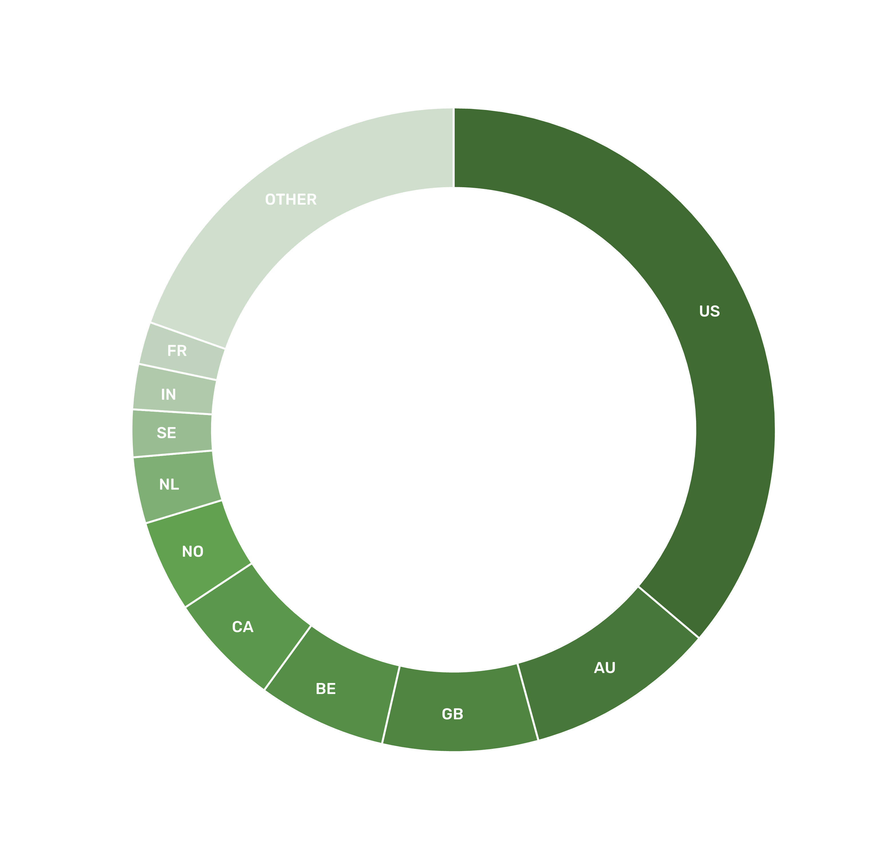{#fig-gbif-ranking width=50%}

Un resumen de los principales datos del Registro en `r anno_actual` y su incremento con respecto al informe anterior de `r anno_informe_anterior` se muestra en la ~~tabla 1.c.~~ Durante este periodo, algunas entidades han reestructurado sus colecciones biológicas y bases de datos. Aquí presentamos la información más relevante, que se verá en detalle en el desarrollo de este informe. 

TABLA AQUI

\newpage
# INTRODUCCIÓN. JUSTIFICACIÓN Y OBJETIVOS

La Infraestructura Mundial de Información en Biodiversidad (GBIF, de sus siglas inglesas, Global Biodiversity Information Facility) es una iniciativa intergubernamental creada para poner en Internet, a disposición pública y de manera gratuita, toda la información disponible sobre los organismos vivos conocidos a nivel mundial, facilitando el acceso a esta información y compartiendo los datos científicos para avance de la ciencia y beneficio de la sociedad. 

A `r mes_anno_actual`, GBIF cuenta entre sus miembros con ~~59 países y 38 organizaciones internacionales~~. España es miembro fundador de GBIF, representada por el Ministerio de Ciencia e Innovación, el cual encomendó al CSIC la gestión científico-técnica del “Nodo Nacional de Información en Biodiversidad para la participación en el Programa Internacional Global Biodiversity Information Facility (BOE, 12 de junio de 2002) y para lo que constituyó la Unidad de Coordinación de GBIF en España, sita en el Real Jardín Botánico de Madrid. 

Para cumplir con sus objetivos, esta Unidad de Coordinación recopila y publica información sobre las entidades que producen, agregan o administran datos e información sobre biodiversidad. Esta información da contexto a los datos publicados sobre biodiversidad en España, permite determinar el estado del conocimiento y establecer sus prioridades, bien de índole científica, bien desde el punto de vista de la gestión y conservación de la biodiversidad y el medioambiente. En el año 2005, la Unidad de Coordinación abrió un registro de las instituciones y proyectos con sede en el territorio español que cuenta con información ligada al conocimiento y la conservación de la biodiversidad. Esta información se encuentra, en unos casos, en **colecciones biológicas** de distintos tipos (zoológicas, botánicas, microbiológicas, paleontológicas y mixtas) que, como tales, contienen ejemplares físicos que sirven de respaldo a la información (ejemplares preservados o sus partes, fósiles, bancos de germoplasma, de tejidos…). En otros casos la información se recoge en **bases de datos** creadas en el ámbito de proyectos de investigación, o de otra índole, sin contar con el respaldo físico de ejemplares (inventarios, listados, eventos de muestreo…). 

Los contenidos de este informe y del sistema informático subyacente se organizan en tres niveles: 

1. entidades (instituciones o centros) y proyectos, 
2. colecciones biológicas o bases de datos de biodiversidad,
3. juegos de datos publicados en línea. 

La información de los dos primeros se recopila mediante formularios que cumplimentan los propios centros, tal como se refleja en el **Registro de instituciones, colecciones y bases de datos de biodiversidad**. La información de los juegos de datos en línea se introduce por parte de los propios responsables en la [plataforma de publicación de datos de GBIF – IPT](http://www.gbif.es/ipt/). El flujo de la información se refleja en la @fig-esquema .


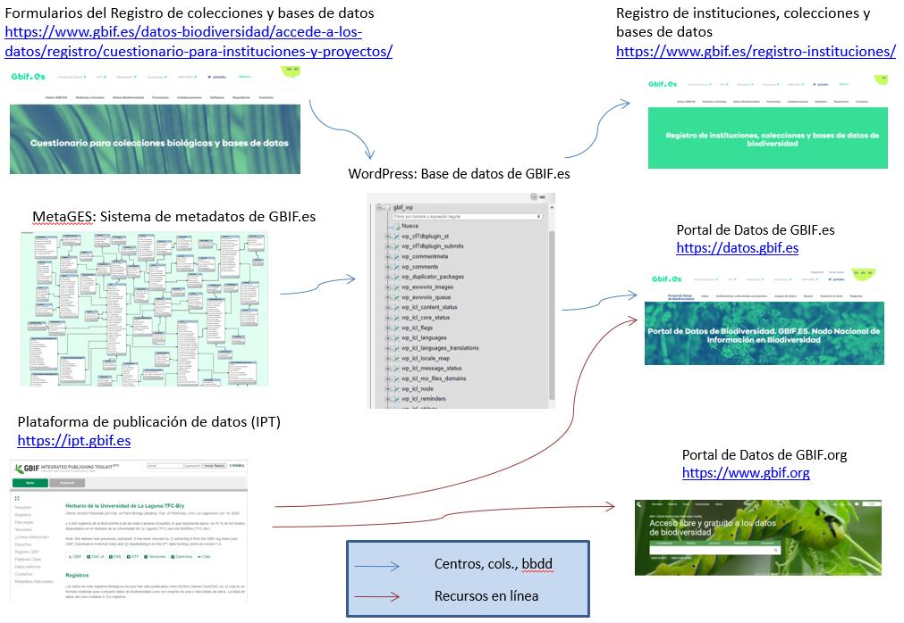{#fig-esquema width="100%"}

La `r n_edicion_informe_anterior` edición del informe, presentado en `r anno_publi_informe_anterior`, recogía la información disponible hasta `r mes_anno_informe_anterior`. En esta `r n_edicion_informe_actual` edición, **“Informe de Colecciones Biológicas y Bases de Datos de Biodiversidad en España. Año `r anno_actual`”**, se presentan los datos y estadísticas de los últimos ~~cinco~~ años (desde `r mes_anno_informe_anterior` hasta `r mes_anno_actual`) en relación a las instituciones, colecciones, bases de datos y proyectos adscritos al Nodo Nacional de Información en Biodiversidad. Se hace una síntesis y valoración de las entidades, sus colecciones, proyectos y datos asociados, con especial relevancia de las que publican datos en el Registro de GBIF.ES.

Se puede acceder a la información del Registro, de manera detallada y continuamente actualizada, desde [](https://www.gbif.es/registro-instituciones/). 

Todos los mapas se han realizado de manera dinamica al generar el informe usando el paquete de R [metagesToolkit](https://gbifes.github.io/metages-toolkit/index.html). Los topónimos de las ciudades que figuran en los mapas de las colecciones biológicas y bases de datos corresponden a los nombres estandarizados segun se introdujeron en MetaGES por parte de los gestores de cada coleccion. El tamaño de las burbujas expresa el nº de ejemplares (para colecciones) o de registros publicados (para bases de datos y colecciones publicadoras). La leyenda se ha estandarizado a lo largo de todos los mapas generados atendiendo a los percentiles 10, 40, 65 y 90 del conjunto total de ejemplares y registros por coleccion o base de datos. Todos los mapas generados pueden visualizarse en [Generación de mapas con metagesToolkit](https://gbifes.github.io/metages-toolkit/articles/crear-mapas.html).

\newpage
# DATOS GENERALES Y FUNCIONAMIENTO DE GBIF

## METODOLOGÍA Y TÉRMINOS USADOS

### Entidades, proyectos, colecciones y bases de datos

A continuación, se detallan y explican los conceptos y términos utilizados en este
informe:

La unidad o nivel principal, llamada **entidad**, es el centro o institución (o
proyecto independiente), que puede albergar una o más **colecciones**, que constituyen el segundo nivel. Estas pueden ser **colecciones biológicas** (ejemplares físicos) o bien colecciones de datos virtuales que son **bases de datos**. Cada colección o base de datos puede dar lugar a uno o más juegos de datos (también llamados a veces recursos o dataset, que serían el tercer nivel. Estos juegos de datos son los que se publican en el [Portal de Datos de Biodiversidad del Nodo Nacional GBIF.ES](https://datos.gbif.es/) y en el [Portal Internacional de GBIF](https://www.gbif.org/).

Los **proyectos** pueden ser independientes y albergar sus propias bases de datos.
En estos casos en el Registro funcionan como entidades y siempre llevan asociadas sus
propias bases de datos, es decir, recursos de datos virtuales. Otras veces los proyectos no son independientes y están vinculados directamente a alguna entidad, que es la que alberga esas bases de datos, y así se indica también su dependencia en el Registro.

HACER ALGO ESTILO https://github.com/iobis/env-data/issues/10#issuecomment-444422701 PARA EXPLICAR JERARQUIAS

~~Ejemplo donde la entidad es un centro o institución. La Sociedad de Ciencias Aranzadi alberga 3 colecciones biológicas y 4 bases de datos (nivel 2), y comparte 5 recursos en los portales (nivel 3):~~ 

~~Ejemplo donde la entidad es un proyecto independiente: el proyecto Observatorio de
seguimiento de los efectos del cambio global de Sierra Nevada (OBSNEV) figura en el nivel de entidad y alberga una colección virtual (base de datos) con 7 recursos en línea.~~

~~Ejemplo de proyecto dependiente de una institución: Flora Mycologica Iberica,
https://www.gbif.es/coleccion/csic-real-jardin-botanico-flora-mycologica-iberica/, depende de la entidad Real Jardín Botánico (CSIC) https://www.gbif.es/instituciones/csic-real-jardinbotanico/ y figura en el nivel de colección (nivel 2) albergando una base de datos.~~

En la @sec-anexo-1 *(Anexo I)*, se pueden ver todas las entidades y proyectos incluidos en el Registro, con sus colecciones y bases de datos asociadas. Es importante indicar que los nombres empleados para instituciones, proyectos, colecciones y recursos, son los proporcionados por los propios responsables vía formularios y mensajes electrónicos, y son también los que figuran en el [Registro de colecciones](https://www.gbif.es/registro-colecciones/). No obstante, en algunos casos concretos se especifica, más allá de la información proporcionada por los responsables, la procedencia de los datos o la vinculación de los proyectos con las instituciones para una mejor comprensión de la información.

### Categorías de las entidades en el Registro {#sec-disciplinas}

Las entidades (centros e instituciones) y sus colecciones —tanto físicas como virtuales— se han agrupado en cinco categorías por grupos taxonómicos y disciplinas para facilitar las comparaciones y los análisis ~~(tabla 3.1.2.)~~.

AÑADIR VISUALIZACION CON IMAGENES O ESQUEMATICA DE LAS DISCIPLINAS

Dentro de la categoría **Zoológica** se distinguen **invertebrados** y **vertebrados** por fines prácticos: el número promedio de registros y ejemplares recogidos en las colecciones y bases de datos de invertebrados es muy superior al de vertebrados, de modo que un abordaje conjunto haría inapreciables estos últimos en cualquier estudio o consulta. Para unos pocos casos en los que no se ha diferenciado entre estos dos grupos, se ha utilizado una tercera categoría: “**Invertebrados y vertebrados**”.

La categoría **Botánica** se subdivide en tres grupos bien reconocidos:

- **Plantas**, en el que se incluyen las plantas vasculares: fanerógamas y criptógamas vasculares como los helechos (pteridofitos), además de musgos y afines (briofitos).
- **Algas**. REQUIERE EXPLICACION DE SI SON MACROALGAS O MIXTAS
- **Hongos**, que incluye los líquenes.

La categoría **Microbiológica** incluye microorganismos, en general bacterias, fitoplancton y zooplancton. La **Paleontológica** las colecciones y bases de datos de organismos fósiles y la categoría **Mixta** colecciones y bases de datos que tienen ejemplares de dos o más de alguna de las categorías anteriores.

## ENTIDADES: SITUACIÓN GENERAL Y MAPA DE LOCALIZACIÓN

### Situación general de las entidades
Desde su inicio, el **Registro de Colecciones Biológicas y Bases de Datos de Biodiversidad en España** el número de entidades (instituciones, centros y proyectos) incluidas se ha ido incrementando de manera constante, de igual manera que las colecciones, bases de datos, registros y datos publicados.

A fecha de `r mes_anno_actual` hay `r n_entidades_actual` entidades (instituciones, centros y proyectos) que forman parte del Nodo Nacional de Información en Biodiversidad de las cuáles `r n_entidades_actual_pub` (el `r n_entidades_actual_pub_x100`) publican datos. Con respecto al informe anterior (`r mes_anno_informe_anterior`) ha habido `r n_entidades_incremento` nuevas incorporaciones.

En la @fig-ent-pub se enumeran las entidades por categorías. Así mismo, se especifica para una el número de entidades que publican datos en GBIF.

Hay que tener en cuenta que una misma entidad puede albergar colecciones o bases de datos que correspondan a más de una categoría, por lo que el número de entidades mixtas es elevado, mientras que, por ejemplo, las exclusivamente microbiológicas es muy reducido. Seobserva también que no hay ninguna entidad exclusivamente microbiológica o paleontológica. Por eso, estas categorías las veremos más adelante mejor diferenciadas y definidas en el 2º nivel, de colecciones biológicas y bases de datos.

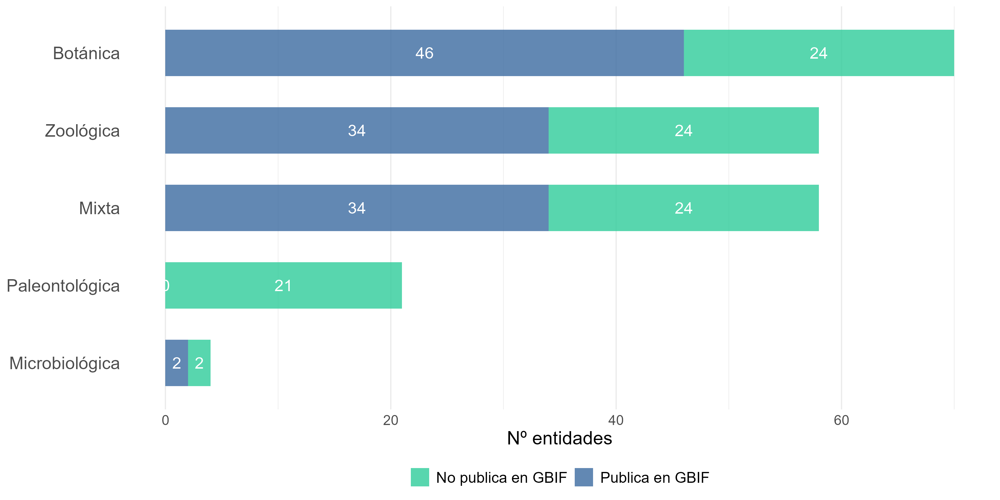{#fig-ent-pub}


::: callout-note
Para las entidades que tienen colecciones de diferentes categorías se ha generalizado para la mejor representada. No existe ninguna entidad paleontológica como tal, sí colecciones paleontológicas que pertenecen a entidades de otras categorías.
:::

### Distribución geográfica de las entidades registradas

La distribución espacial de las entidades registradas que forman parte del Nodo Nacional de Información en Biodiversidad, queda reflejada en la @fig-map-ent Se observa dónde pueden localizarse las entidades que forman parte del Registro en España por provincia. Se destacan las que publican datos (círculos de color verde) de las que no (círculos de color gris).

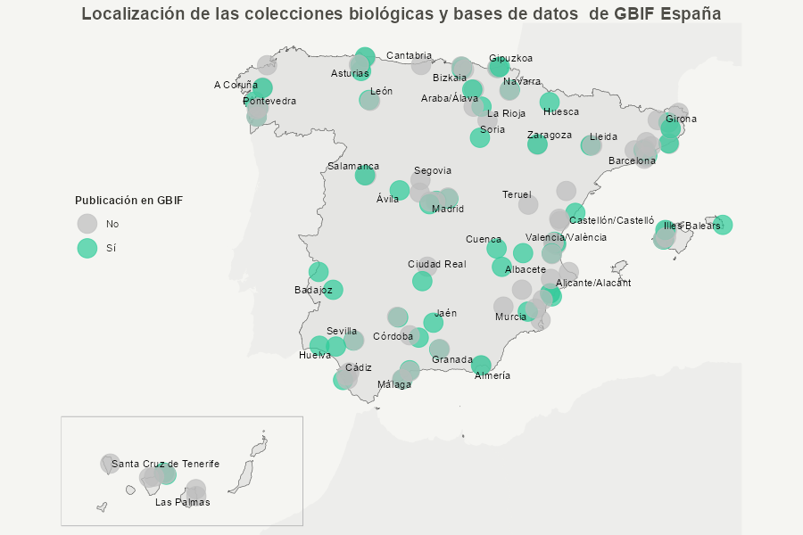{#fig-map-ent}

## SITUACIÓN GENERAL DE LAS COLECCIONES BIOLÓGICAS Y BASES DE DATOS: TOTAL DE REGISTROS, ACTUALIZACIONES E INCORPORACIONES

Actualmente hay contabilizadas `r n_colbd_actual` colecciones biológicas y bases de datos
pertenecientes a `r n_entidades_actual` entidades. Desde 2004, que se tienen datos en el Registro, ha habido un aumento anual constante, tal como refleja la @fig-col-anno , donde se indican los totales y el número de nuevas incorporaciones por año. ~~En los últimos cinco años (periodo 2015-2019),~~ desde el anterior informe, se han incrementado en `r n_colbd_incremento` el número de colecciones y bases de datos.

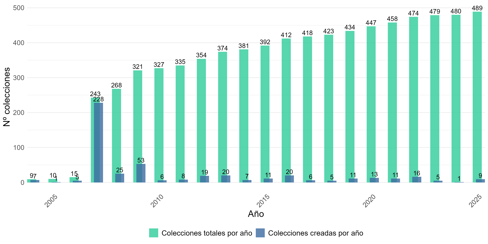{#fig-col-anno} 

En la @tbl-col-vs-bd podemos ver el número y porcentaje de colecciones biológicas (físicas)
y bases de datos (digitales) del Registro.

```{r}
#| label: tbl-col-vs-bd
#| tbl-cap: "Número y porcentaje de colecciones biológicas (físicas) y bases de datos (digitales) registradas."

proporcion_col_base <- readRDS("data/vistas_sql/proporcion_col_base.rds")

ft_tbl(
  proporcion_col_base,
  caption = "Tabla 3.3.b. Número y porcentaje de colecciones biológicas (físicas) y bases de datos (digitales) registradas."
)

```


En la @fig-col-pub y @fig-col-disc se resumen las colecciones biológicas y bases de datos en
función por categorías. 

{#fig-col-pub}

{#fig-col-disc}


### Incorporación de registros a la red de GBIF

A fecha de `r mes_anno_actual`, de las `r n_colbd_actual` colecciones biológicas y bases de datos del Registro, hay `r n_colbd_actual_pub` (`r n_colbd_actual_pub_x100`) que publican datos a través de sus `r n_recursos_actual` recursos en línea (juegos de datos), constituyendo así el aporte de datos del Nodo Nacional de Información en Biodiversidad, que suman en total `r n_registros_actual` registros, y que colocan am España como décimo país por registros publicados en la red internacional de GBIF.

En la @tbl-comparativa-colbd-informes se muestra una comparativa entre los registros publicados en `r anno_publi_informe_anterior` y los de `r anno_actual`. El incremento de registros en ese periodo ha sido de `r n_registros_incremento` (`r n_registros_incremento_x100`).

```{r}
#| label: tbl-comparativa-colbd-informes
#| tbl-cap: "Comparativa del número total de colecciones biológicas y bases de datos, con registros publicados y número de registros, según su categoría entre los datos del informe anterior y el actual."

colbd_comp <- readRDS("data/vistas_sql/colecciones_por_disciplina_y_sub.rds") %>%
              transmute(Disciplina = disciplina,
                        !!paste0("Nº colecciones y bases de datos (", 
                               anno_informe_anterior, 
                               ")") := c(inf_ant_n_colbd_zoo, inf_ant_n_colbd_inv,
                                        inf_ant_n_colbd_ver, inf_ant_n_colbd_invver,
                                        inf_ant_n_colbd_bot, inf_ant_n_colbd_pla,
                                        inf_ant_n_colbd_alg, inf_ant_n_colbd_hong,
                                        inf_ant_n_colbd_botmix, inf_ant_n_colbd_micro, 
                                        inf_ant_n_colbd_mix, inf_ant_n_colbd_paleo,
                                        inf_ant_n_colbd_total),
                        !!paste0("Nº registros publicados en GBIF (", 
                               anno_informe_anterior, 
                               ")") := c(inf_ant_n_reg_zoo, inf_ant_n_reg_inv,
                                        inf_ant_n_reg_ver, inf_ant_n_reg_invver,
                                        inf_ant_n_reg_bot, inf_ant_n_reg_pla,
                                        inf_ant_n_reg_alg, inf_ant_n_reg_hong,
                                        inf_ant_n_reg_botmix, inf_ant_n_reg_micro,
                                        inf_ant_n_reg_mix, inf_ant_n_reg_paleo,
                                        inf_ant_n_reg_total),
                        !!paste0("Nº colecciones y bases de datos (", anno_actual, ")") := n_colecciones,
                        !!paste0("Nº registros publicados en GBIF (", anno_actual, ")") := n_registros_publicados)


ft_tbl(
  colbd_comp,
  caption = "Tabla 3.3.1.a. Comparativa entre ~2014 y 2019~ del número total de colecciones biológicas y bases de datos, con registros publicados y número de registros, según su categoría.
"
)
```

~~En la gráfica 3.3.1.b.~~ podemos ver la progresión del número de registros publicados en GBIF desde 2005 hasta `r mes_anno_actual` hasta alcanzar los `r n_registros_actual` registros actuales.

GRAFICA AQUI (Katia la hace con sus tabla de datos)

Otro punto de vista bajo el que analizar las entidades, colecciones y datos de
biodiversidad del Registro, es el ámbito o sector en el que se enmarcan las mismas, y así se han distinguido los siguientes:
- **Académico**: instituciones educativas, museos, centros de investigación o vinculados a
proyectos concretos de investigación.
- **Administraciones públicas**: gobiernos de las CCAA, ayuntamientos, consejerías,
cabildos…
- **Ciencia ciudadana**: principalmente asociaciones y centros de información
medioambiental cuyos datos proceden generalmente de voluntarios y aficionados,
profesionales o no.
- **Sector privado**: empresas privadas.

~~La mayor parte de las colecciones y bases de datos proceden del ámbito académico,
mientras que por número de registros son las administraciones públicas y las de ciencia ciudadana los sectores que más aportan. Es de destacar que desde mediados de 2019 se incorpora el sector privado al ámbito de GBIF, con la cementera LafargeHolcim España, que publicó un primer juego de datos en 2019. Se abre así una nueva entrada de datos, que por volumen y foco (estudios de impacto ambiental, restauración de paisaje), puede completar y complementar el mundo de los datos de biodiversidad de manera relevante.~~

Como las entidades y colecciones pueden asignarse a más de un sector, la distribución de datos entre ellas se ve más claramente a nivel de recursos en línea y registros publicados. El desglose de estos datos por sectores se ve en la @tbl-registros-sector y en la @fig-rec-sec y @fig-reg-sec

```{r}
#| label: tbl-registros-sector
#| tbl-cap: "Recursos clasificados por sectores (número de recursos y registros)."

df <- readRDS("data/vistas_sql/registros_por_sector.rds")

ft_tbl(
  df,
  caption = "Tabla xx. Recursos clasificados por sectores (número de recursos y registros)."
)
```

{#fig-rec-sec}

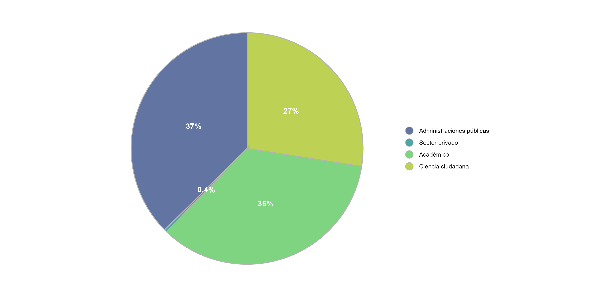{#fig-reg-sec}

Por último, examinamos los datos publicados en GBIF por parte de entidades españolas desde el punto de vista del tipo de registro de los juegos de datos. En la red de GBIF —de la mano de la especificación “Darwin Core Archive”— se reconocen cuatro tipos:

- **Registros de presencia** (en inglés “occurrences”). Cada registro contiene
información sobre la presencia (o ausencia) de una especie en un lugar y en un período de tiempo determinados. Los registros correspondientes a ejemplares de colecciones biológicas (físicas) son un ejemplo de este caso. Observaciones ocasionales hechas por ciudadanos de una planta en el campo, también.

- **Registros asociados a una metodología** explícita de muestreo sistemático ligado a un lugar y en un período de tiempo determinados (llamado en este contexto “evento/event”). Estos recursos, en terminología de GBIF se conocen como “event-based datasets”). Por ejemplo, muestreos periódicos en parcelas, seguimiento de especies en transectos, muestreos [LTER](https://lternet.edu/).

- **Registros que dan información de especies** con un cierto nivel abstracción, no ligada a individuos, ejemplares u observaciones concretas. En terminología GBIF, “checklists”. Pertenecen a este grupo recursos que contienen listas de especies presentes en un territorio, listas de especies con sus nombres comunes usados en un territorio, listas rojas, especies protegidas en un territorio con sus descripciones, aves avistadas en un transecto visitado cada mes, etc.

- **Registros no publicados**, solo se hacen disponibles los metadatos del juego de datos. (“metadata”). 

Hay que tener en cuenta que todos los registros de un juego de datos han de ser del mismo tipo. Según estos tipos, los números para los recursos en línea accesibles vía GBIF procedentes de entidades españolas se muestran en la  ~~tabla 3.3.1.f ~~.

~~TABLA AQUI (IPT??)~~


### Actualización de las colecciones publicadas en GBIF

~~De las `r n_colbd_actual` colecciones y bases de datos del Registro en `r anno_actual`, han actualizado sus metadatos 80 (el 17 %) desde 2015. Así mismo, 180 de los `r n_recursos_actual` recursos (el 58 %) se han incorporado nuevos o se han actualizado en este mismo periodo.~~

\newpage
# COLECCIONES BIOLÓGICAS

## ANÁLISIS Y SITUACIÓN GENERAL

### Situación general

Actualmente, dadas de alta en el Registro encontramos `r n_entidades_col_actual` entidades que en total mantienen `r n_col_actual` colecciones biológicas(físicas) registradas en el Nodo Nacional de Biodiversidad. La @tbl-col-disciplina muestra el número de colecciones biológicas por las categorías ya reseñadas y el porcentaje para cada una.

```{r}
#| label: tbl-col-disciplina
#| tbl-cap: "Número y porcentaje de las colecciones biológicas en función de las categorías utilizadas."

df <- readRDS("data/vistas_sql/colecciones_por_disciplina.rds") |>
          select (-total_ejemplares)

ft_tbl(
  df,
  caption = "Tabla xx. Número y porcentaje de las colecciones biológicas en función de las categorías utilizadas)."
)
```

### Fondos y estado de informatización de las colecciones biológicas

La información sobre los fondos de las colecciones biológicas del Registro ha sido
proporcionada para el `r informatizacion_proporcionada_x100`  de las colecciones. Los datos aquí reflejados se corresponden con las últimas actualizaciones aportadas. Conviene indicar también que el número de registros publicados en GBIF no tiene por qué ir a la par del grado de informatización de los fondos de estas instituciones.

En la @tbl-col-informatizacion  puede verse el número y porcentaje de informatización de las colecciones biológicas de las entidades según sus categorías.

```{r}
#| label: tbl-col-informatizacion
#| tbl-cap: "Fondos y estado de informatización por categorías de las colecciones biológicas de las instituciones"

df <- readRDS("data/vistas_sql/colecciones_informatizacion.rds")

ft_tbl(
  df,
  caption = "Tabla xx. Fondos y estado de informatización por categorías de las colecciones biológicas de las
instituciones)."
)
```

### Estado de conservación de las colecciones biológicas

A continuación, se muestra el estado de conservación de las colecciones biológicas
según la valoración realizada por los responsables de las colecciones @tbl-col-estado-conservacion La información mostrada se basa en los datos proporcionados por el `r estado_conservacion_proporcionada_x100` de las colecciones.

```{r}
#| label: tbl-col-estado-conservacion
#| tbl-cap: "Número de colecciones biológicas españolas participantes en GBIF en relación a su estado de conservación." 

tabla_condiciones <- readRDS("data/vistas_sql/estado_conservacion.rds")

ft_tbl(
  tabla_condiciones,
  caption = "Tabla 4.1.3. Número de colecciones biológicas españolas participantes en GBIF en relación a su estado de
conservación."
)
```


### Accesibilidad de las colecciones

#### Accesibilidad a los ejemplares

A continuación, se representan en la @tbl-col-acceso-ejemplares las colecciones biológicas en función de su forma de acceso a los ejemplares. Se han establecido cuatro categorías que los responsables o personas de contacto han cumplimentado en los formularios. Ha de tenerse en cuenta que esta información ha sido proporcionada por el `r acceso_ejemplares_proporcionada_x100` de las colecciones. En el caso de los préstamos, a veces incluyen restricciones puntuales del uso de los ejemplares.

```{r}
#| label: tbl-col-acceso-ejemplares
#| tbl-cap: "Acceso a las colecciones biológicas españolas participantes en GBIF."

tabla_acceso_ejem <- readRDS("data/vistas_sql/acceso_ejemplares.rds")

ft_tbl(
  tabla_acceso_ejem,
  caption = "Tabla 4.1.4.1. Acceso a las colecciones biológicas españolas participantes en GBIF."
)
```

#### Accesibilidad a los datos informatizados

#### Posibilidad de acceso a los datos

Se representa, a continuación, el grado de acceso a los datos informatizados de las
colecciones que facilitaron dicha información (el `r acceso_informatizado_proporcionada_x100`).

```{r}
#| label: tbl-col-acceso_informatizado
#| tbl-cap: "Posibilidad de acceso a los datos informatizados de las colecciones biológicas españolas en función de las categorías propuestas."

tabla_acceso_inform <- readRDS("data/vistas_sql/acceso_informatizado.rds")

ft_tbl(
  tabla_acceso_inform,
  caption = "Tabla 4.1.4.2.1. Posibilidad de acceso a los datos informatizados de las colecciones biológicas españolas en función de las categorías propuestas"
)
```

#### Medio de acceso a los datos informatizados

A continuación, puede verse representada la manera de acceder a los registros
informatizados de las colecciones según lo dispuesto por cada entidad responsable, basada en las respuestas proporcionadas por el `r medio_acceso_informatizado_proporcionada_x100` de las colecciones. Una misma colección pudo proporcionar respuestas incluidas en más de una categoría. (Ejemplo: “a través del responsable” y “a través de Intranet”).

```{r}
#| label: tbl-col-medio-acceso-informatizado
#| tbl-cap: "Forma de acceso a los datos informatizados de las colecciones biológicas según las categorías propuestas."

tabla_medio_acceso_inform <- readRDS("data/vistas_sql/medio_acceso_inform.rds")

ft_tbl(
  tabla_medio_acceso_inform,
  caption = "Tabla 4.1.4.2.2. Forma de acceso a los datos informatizados de las colecciones biológicas según las categorías propuestas."
)
```

### Colecciones biológicas que publican en GBIF

De las `r n_col_actual` colecciones biológicas registradas, `r n_col_actual_pub` (`r n_col_actual_pub_x100`) publican en GBIF. Estas `r n_col_actual_pub` colecciones pertenecen a `r n_entidades_col_actual_pub` entidades distintas, y en total publican en línea `r n_registros_col_actual` registros. En la @tbl-registros-disciplina se puede ver el número de registros publicados por categorías y sus porcentajes.

La colección `r top_col[1,2]` *`r top_col[1,1]`* del `r top_col[1,4]` es la que más registros
publica, con `r top_col[1,3]`, seguida de la `r top_col[2,2]` *`r top_col[2,1]`*, con `r top_col[2,3]`, y de la colección `r top_col[3,2]` *`r top_col[3,1]`*, con `r top_col[3,3]` registros. En los apartados ~~4.2. a 4.6. se revisan en detalle y por categorías (grupos taxonómicos/disciplinas) los datos de Las colecciones biológicas definidos en la tabla 3.1.2.a.~~

```{r}
#| label: tbl-registros-disciplina
#| tbl-cap: "Número de registros publicados de colecciones biológicas por categorías."

tabla_registros <- readRDS("data/vistas_sql/registros_por_disciplina_col.rds")

ft_tbl(
  tabla_registros,
  caption = "Tabla 4.1.5.a. Número de registros publicados de colecciones biológicas por categorías."
)
```

### Distribución de las colecciones biológicas

La @fig-map-col-pub muestra la distribución de colecciones biológicas en el territorio español, tanto peninsular como insular. Destacan las CC.AA. de Andalucía, Madrid y Cataluña en cuanto a número de entidades que publican datos, mientras que en el otro extremo se encuentra, por ejemplo, Cantabria, con ninguna entidad publicadora de datos, o Castilla-La Mancha, Castilla y León y Extremadura, con un máximo de dos entidades publicadoras en cada CC.AA. En el caso de la Comunidad Valenciana, el elevado número de entidades presentes en el registro de colecciones contrasta con el número de las que publican datos (solo dos).~~

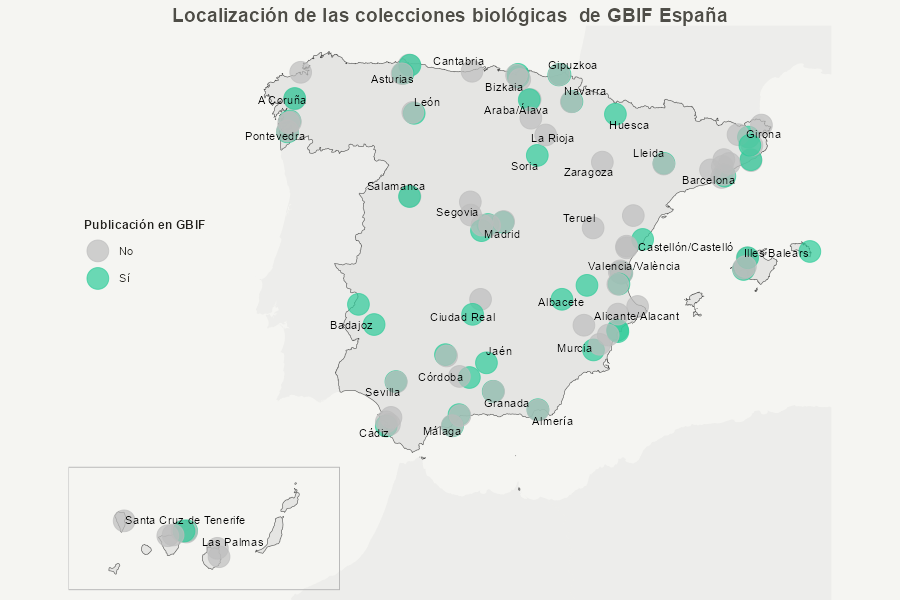{#fig-map-col-pub}


## COLECCIONES ZOOLÓGICAS

Como se indica en la @sec-disciplinas las colecciones zoológicas se dividen para su presentación de datos en invertebrados y vertebrados, más un tercer grupo (“Invertebrados y vertebrados”) para las colecciones que presentan los datos de los dos grupos anteriores de manera conjunta. La @tbl-col-zoo desglosa los subtipos zoológicos, su proporción, el número de ejemplares que albergan y los registros publicados.

```{r}
#| label: tbl-col-zoo
#| tbl-cap: "Colecciones zoológicas y su proporción según subtipos, con indicación del número de ejemplares y registros que publican."

tabla_sub_zoo <- readRDS("data/vistas_sql/colecciones_por_subdisciplina_zoologica.rds")

ft_tbl(
  tabla_sub_zoo,
  caption = "Tabla 4.2. Colecciones zoológicas y su proporción según subtipos, con indicación del número de ejemplares y registros que publican."
)
```

### Estado de informatización de las colecciones zoológicas

Se recopila en esta sección la informatización para el conjunto de las `r n_col_zoo` colecciones zoológicas de las que `r n_col_zoo_pub` publican datos en GBIF, y también se desglosan en las tres subcategorías. La @tbl-col-zoo-informatizacion muestra el porcentaje de informatización de los ejemplares que albergan y su proporción.

```{r}
#| label: tbl-col-zoo-informatizacion
#| tbl-cap: "Número de colecciones zoológicas por subtipos en relación al estado de informatización desus ejemplares."

tabla_inform_zoo <- readRDS("data/vistas_sql/colecciones_informatizacion_ejemplares_zoo.rds") %>% 
                    select(-total_ejemplares)

ft_tbl(
  tabla_inform_zoo,
  caption = "Tabla 4.2.1.a. Número de colecciones zoológicas por subtipos en relación al estado de informatización desus ejemplares."
)
```

En relación al software o sistema de informatización y gestión de las colecciones, la
nueva aplicación Elysia se está usando en algunas colecciones zoológicas en sustitución de la herramienta Zoorbar. La @tbl-col-zoo-software muestra las colecciones zoológicas en relación a los softwares utilizados para la informatización de sus ejemplares.

```{r}
#| label: tbl-col-zoo-software
#| tbl-cap: "Número de colecciones zoológicas españolas en relación a los softwares de informatización. * Incluye Access, Excel y otros sistemas que no especificaron los proveedores."

tabla_soft_zoo <- readRDS("data/vistas_sql/colecciones_uso_software_zoo.rds")

ft_tbl(
  tabla_soft_zoo,
  caption = "Tabla 4.2.1.b. Número de colecciones zoológicas españolas en relación a los softwares de informatización. * Incluye Access, Excel y otros sistemas que no especificaron los proveedores."
)
```

### Colecciones zoológicas: invertebrados

Actualmente hay dadas de alta en el Registro del Nodo Nacional de Información en
Biodiversidad `r n_col_inv` colecciones zoológicas de invertebrados pertenecientes a `r n_entidades_col_inv` entidades distintas. En el @sec-anexo-1 figura el listado de estas colecciones asociadas a sus códigos y entidades.

### Mapa de distribución de las colecciones zoológicas de invertebrados en España

En la @fig-map-col-inv y @fig-map-col-inv-pub se muestran las colecciones zoológicas de
invertebrados, representadas en función de la localidad donde se ubica la entidad. En el primer mapa se muestran el total de colecciones de las entidades colaboradoras y en el segundo el número de colecciones que publican a través de los portales GBIF.

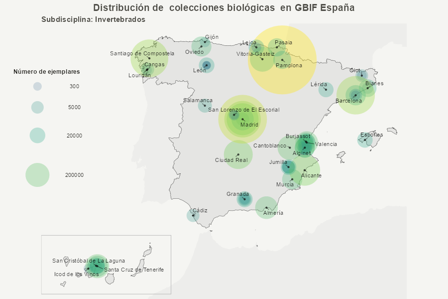{#fig-map-col-inv}

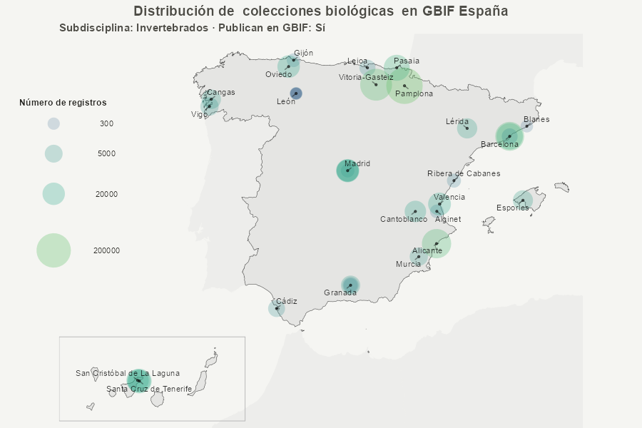{#fig-map-col-inv-pub}

### Grandes colecciones zoológicas de invertebrados

Destaca la colección *`r top_col_inv[1,1]`* (`r top_col_inv[1,2]`) del *`r top_col_inv[1,4]`*, con `r top_col_inv[1,3]` ejemplares; seguida de las coleccines *`r top_col_inv[2,1]`* (`r top_col_inv[2,2]`), con `r top_col_inv[2,3]` ejemplares y *`r top_col_inv[3,1]`* (`r top_col_inv[3,2]`), con `r top_col_inv[3,3]` ejemplares. La @fig-barplot-inv muestra las 10 colecciones de vertebrados que más ejemplares albergan ordenadas por nº de registros. En la @sec-anexo-1 figura el listado de estas colecciones asociadas a sus códigos y entidades.

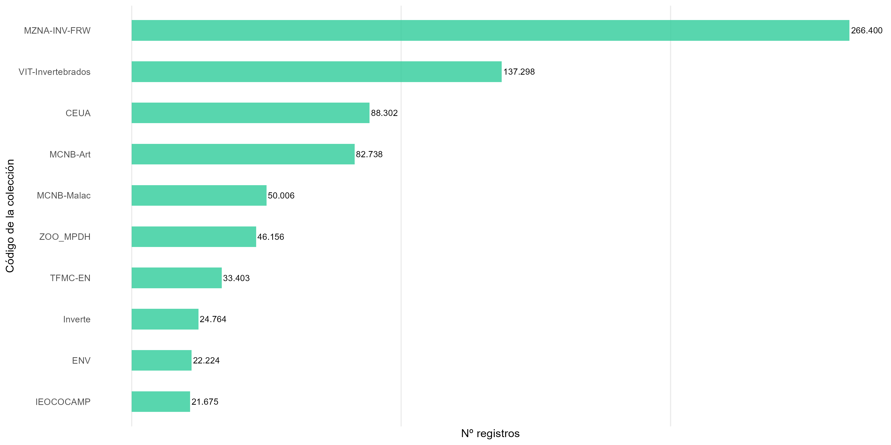{#fig-barplot-inv}

### Colecciones zoológicas: vertebrados

Actualmente hay dadas de alta en el Registro del Nodo Nacional de Información en
Biodiversidad `r n_col_ver` colecciones de vertebrados pertenecientes a `r n_entidades_col_ver` entidades distintas. En la @sec-anexo-1 figura el listado de estas colecciones asociadas a sus códigos y entidades.

### Mapa de distribución de las colecciones zoológicas de vertebrados en España

En la @fig-map-col-ver y @fig-map-col-ver-pub se muestran las colecciones zoológicas de
vertebrados, representadas en función de la localidad donde se ubica la entidad. En el primer mapa se muestran el total de colecciones de las entidades colaboradoras y en el segundo el número de colecciones que publican a través de los portales GBIF.


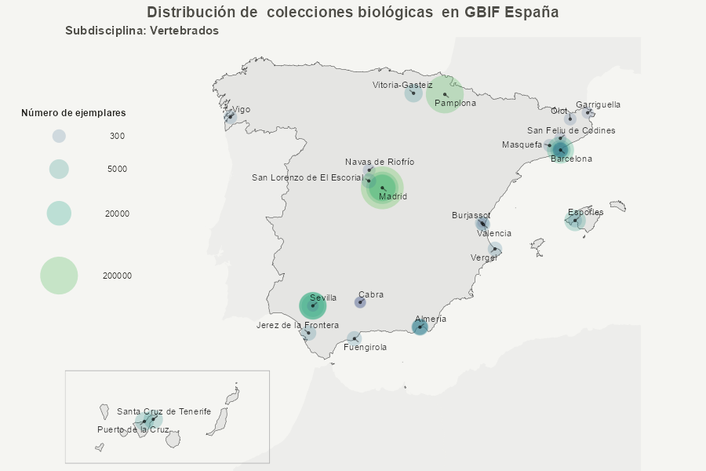{#fig-map-col-ver}

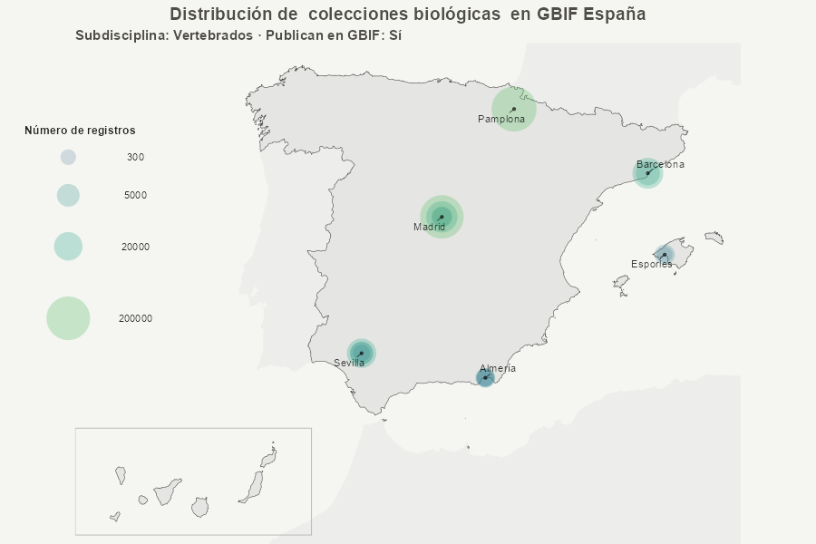{#fig-map-col-ver-pub}

### Grandes colecciones zoológicas de vertebrados

De las grandes colecciones zoológicas de vertebrados del Registro, destaca en primer lugar *`r top_col_ver[1,1]`* (`r top_col_ver[1,2]`) del *`r top_col_ver[1,4]`*, con `r top_col_ver[1,3]` ejemplares; seguida de *`r top_col_ver[2,1]`* (`r top_col_ver[2,2]`), con `r top_col_ver[2,3]` ejemplares y de *`r top_col_ver[3,1]`* (`r top_col_ver[3,2]`), con `r top_col_ver[3,3]` ejemplares. La @fig-barplot-ver muestra las 10 colecciones de vertebrados que más ejemplares albergan ordenadas por nº de registros. En la @sec-anexo-1 figura el listado de estas colecciones asociadas a sus códigos y entidades.

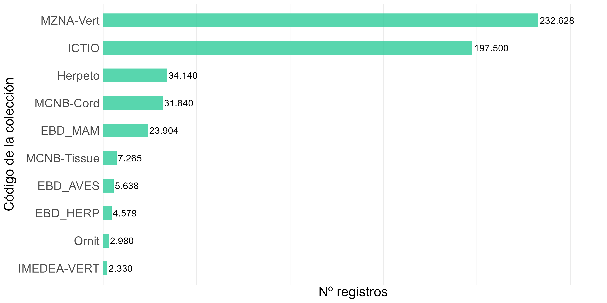{#fig-barplot-ver}

### Colecciones zoológicas conjuntas de invertebrados y vertebrados

Actualmente hay dadas de alta en el Registro del Nodo Nacional de Información en
Biodiversidad `r n_col_invver` colecciones conjuntas de vertebrados e invertebrados pertenecientes a `r n_entidades_col_invver` entidades distintas.

### Mapa de distribución de las colecciones zoológicas conjuntas de invertebrados y vertebrados en España

En la @fig-map-col-invver y @fig-map-col-invver-pub se muestran las colecciones zoológicas conjuntas de invertebrados y vertebrados, representadas en función de la localidad donde se ubica la entidad. En el primer mapa se muestran el total de colecciones de las entidades colaboradoras y en el segundo las colecciones que publican a través de los portales GBIF.

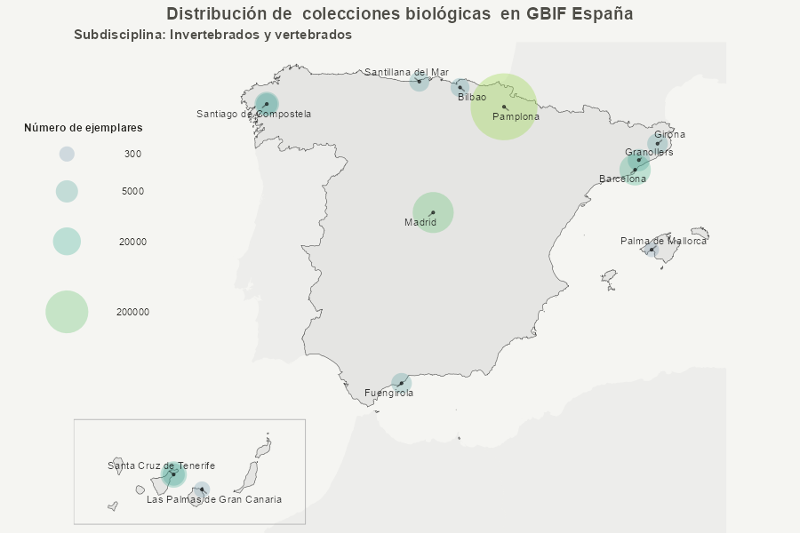{#fig-map-col-invver}

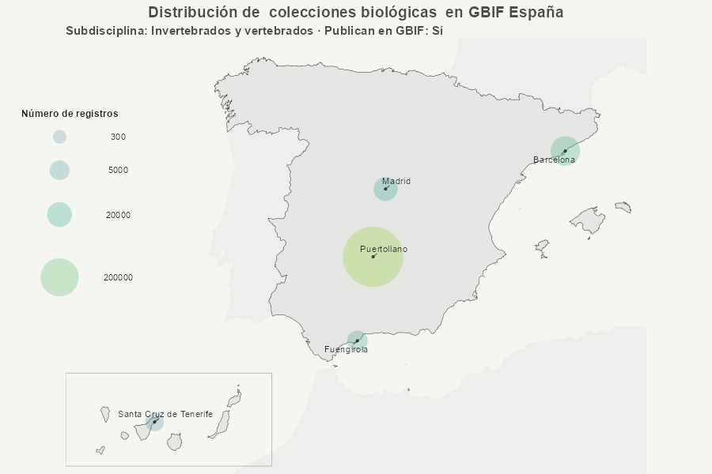{#fig-map-col-invver-pub}

### Grandes colecciones zoológicas conjuntas de invertebrados y vertebrados

De las grandes colecciones zoológicas conjuntas de invertebrados y vertebrados del
Registro, destaca en primer lugar *`r top_col_invver[1,1]`* (`r top_col_invver[1,2]`) del *`r top_col_invver[1,4]`*, con `r top_col_invver[1,3]` ejemplares; seguida de *`r top_col_invver[2,1]`* (`r top_col_invver[2,2]`), con `r top_col_invver[2,3]` ejemplares y de *`r top_col_invver[3,1]`* (`r top_col_invver[3,2]`), con `r top_col_invver[3,3]` ejemplares. La @fig-barplot-invver ~~muestra las 10 colecciones de vertebrados que más ejemplares albergan ordenadas por nº de registros. En la @sec-anexo-1 figura el listado de estas colecciones asociadas a sus códigos y entidades.

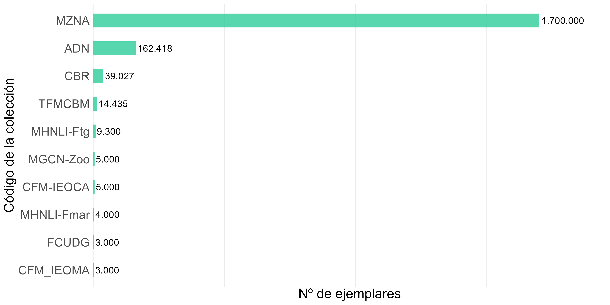{#fig-barplot-invver}


### Colecciones zoológicas que publican datos en GBIF

En la @fig-barplot-zoo podemos ver las diez colecciones zoológicas que más registros publican en los portales de GBIF ordenadas por nº de registros. En la @sec-anexo-1 figura el listado de estas colecciones asociadas a sus códigos y entidades.

{#fig-barplot-zoo}

## COLECCIONES BOTÁNICAS

Las colecciones botánicas se dividen en cuatro grupos o subtipos: Plantas, Algas, Hongos y líquenes y Botánicas mixtas, tal como se refleja en la ~~tabla 3.1.2.a. La @tbl-col-bot ~~ muestra el desglose por subtipos botánicos y su proporción.

```{r}
#| label: tbl-col-bot
#| tbl-cap: "Colecciones botánicas según subtipos y su proporción, con indicación del número de ejemplares que albergan y los registros que publican."

tabla_sub_bot <- readRDS("data/vistas_sql/colecciones_por_subdisciplina_botanica.rds")

ft_tbl(
  tabla_sub_bot,
  caption = "Tabla 4.3. Colecciones botánicas según subtipos y su proporción, con indicación del número de ejemplares que albergan y los registros que publican.
"
)
```

### Estado de informatización de las colecciones botánicas

Se detalla la informatización para el conjunto de las `r n_col_bot` colecciones botánicas, de las que `r n_col_bot_pub` publican datos en GBIF, y también se desglosan en las tres subcategorías diferenciadas para este grupo. La @tbl-col-bot-informatizacion muestra el porcentaje de informatización de los ejemplares que albergan y su proporción. Nótese que el nº de registros publicados es mayor que el de informatizados. Este desfase de debe a una desactualización en la información proporcionada para el Registro.

```{r}
#| label: tbl-col-bot-informatizacion
#| tbl-cap: "Número de colecciones botánicas por subtipos en relación al estado de informatización de sus ejemplares"

tabla_inform_bot <- readRDS("data/vistas_sql/colecciones_informatizacion_ejemplares_bot.rds") %>% 
                    select(-total_ejemplares)

ft_tbl(
  tabla_inform_bot,
  caption = "Tabla 4.3.1.a. Número de colecciones botánicas por subtipos en relación al estado de informatización de sus ejemplares"
)
```

En relación al software o sistema de informatización y gestión de las colecciones, la
nueva aplicación Elysia se está usando en algunas colecciones botánicas en sustitución de la herramienta Herbar. La @tbl-col-bot-software muestra las colecciones botánicas en relación a los softwares utilizados para la informatización de sus ejemplares.

```{r}
#| label: tbl-col-bot-software
#| tbl-cap: "Número de colecciones botánicas españolas en relación a los softwares de informatización."

tabla_soft_bot <- readRDS("data/vistas_sql/colecciones_uso_software_bot.rds")

ft_tbl(
  tabla_soft_bot,
  caption = "Tabla 4.3.1.b. Número de colecciones botánicas españolas en relación a los softwares de informatización."
)
```


### Colecciones de plantas

Actualmente hay dadas de alta en el Registro del Nodo Nacional de Información en
Biodiversidad `r n_col_pla` colecciones botánicas de plantas pertenecientes a `r n_entidades_col_pla` entidades distintas. En la @sec-anexo-1 figura el listado de estas colecciones asociadas a sus códigos y entidades.

### Mapa de distribución de las colecciones de plantas

En @fig-map-col-pla y @fig-map-col-pla-pub se muestran las colecciones botánicas de plantas representadas en función de la localidad donde se ubica la entidad. En el primer mapa se muestran el total de colecciones de las entidades colaboradoras y en el segundo las colecciones que publican datos a través de los portales GBIF.

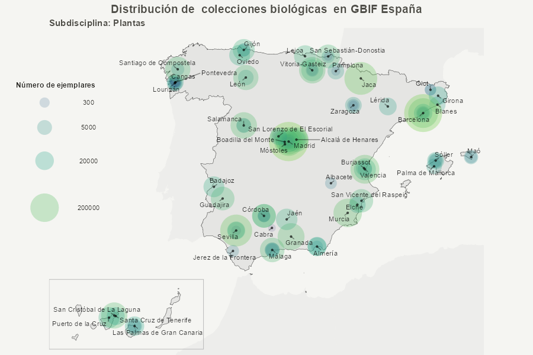{#fig-map-col-pla}

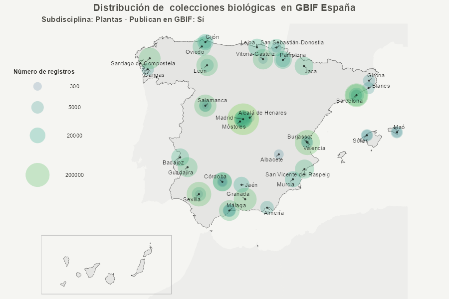{#fig-map-col-pla-pub}

### Grandes colecciones de plantas

De las grandes colecciones botánicas de plantas del Registro, destaca en primer lugar *`r top_col_pla[1,1]`* (`r top_col_pla[1,2]`) del *`r top_col_pla[1,4]`*, con `r top_col_pla[1,3]` ejemplares; seguida de *`r top_col_pla[2,1]`* (`r top_col_pla[2,2]`), con `r top_col_pla[2,3]` ejemplares y de *`r top_col_pla[3,1]`* (`r top_col_pla[3,2]`), con `r top_col_pla[3,3]` ejemplares. La @fig-barplot-pla muestra las 10 colecciones botánicas que más ejemplares albergan ordenadas por nº de registros. En la @sec-anexo-1 figura el listado de estas colecciones asociadas a sus códigos y entidades.

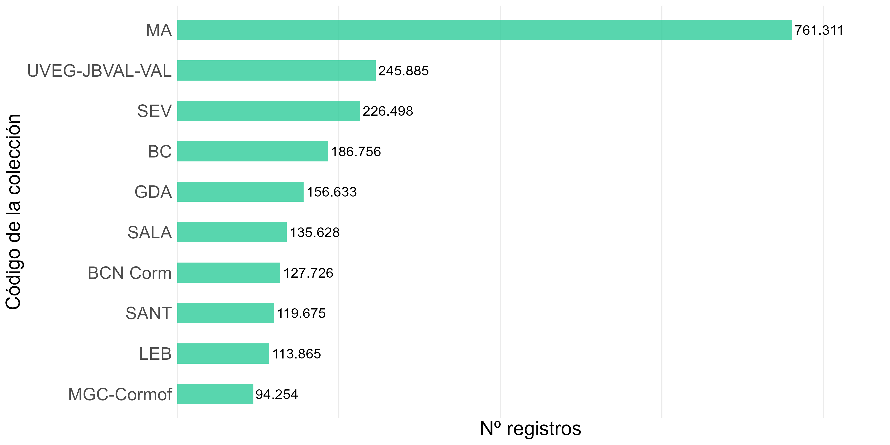{#fig-barplot-pla}

### Colecciones de algas

Actualmente hay dadas de alta en el Registro del Nodo Nacional de Información en
Biodiversidad `r n_col_alg` colecciones botánicas de algas pertenecientes a `r n_entidades_col_alg` entidades distintas. En la @sec-anexo-1 figura el listado de estas colecciones asociadas a sus códigos y entidades.


### Mapa de distribución de las colecciones de algas

En la @fig-map-col-alg y @fig-map-col-alg-pub se muestran las colecciones botánicas de algas representadas en función de la localidad donde se ubica la entidad. En el primer mapa se muestran el total de colecciones de las entidades colaboradoras y en el segundo las colecciones que publican a través de los portales GBIF.


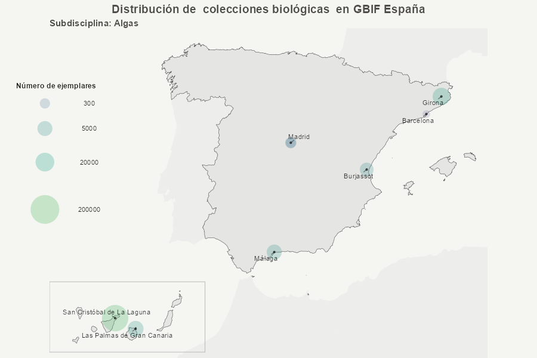{#fig-map-col-alg}

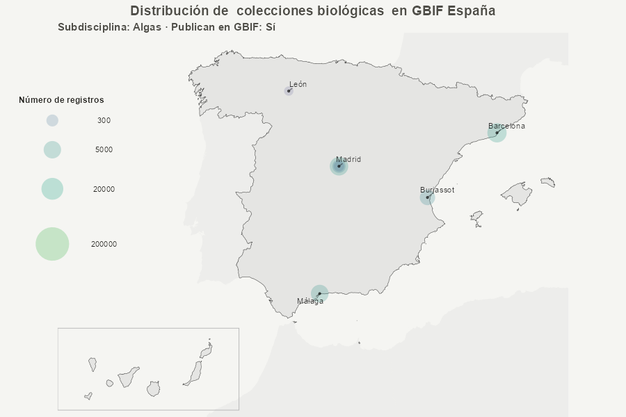{#fig-map-col-alg-pub}

### Grandes colecciones de algas

De las grandes colecciones botánicas de algas del Registro, destaca en primer lugar *`r top_col_alg[1,1]`* (`r top_col_alg[1,2]`) del *`r top_col_alg[1,4]`*, con `r top_col_alg[1,3]` ejemplares; seguida de *`r top_col_alg[2,1]`* (`r top_col_alg[2,2]`), con `r top_col_alg[2,3]` ejemplares y de *`r top_col_alg[3,1]`* (`r top_col_alg[3,2]`), con `r top_col_alg[3,3]` ejemplares. La @fig-barplot-alg muestra las 10 colecciones botánicas de algas que más ejemplares albergan ordenadas por nº de registros. En la @sec-anexo-1 figura el listado de estas colecciones asociadas a sus códigos y entidades.

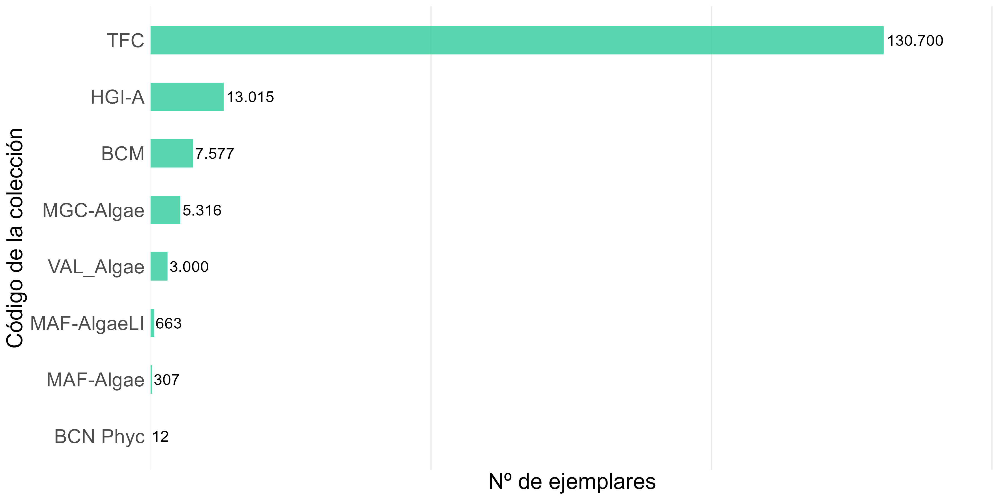{#fig-barplot-alg}


### Colecciones de Hongos y líquenes

Actualmente hay dadas de alta en el Registro del Nodo Nacional de Información en Biodiversidad `r n_col_hong` colecciones de hongos y líquenes pertenecientes a `r n_entidades_col_hong` entidades distintas. En la @sec-anexo-1 figura el listado de estas colecciones asociadas a sus códigos y entidades.

### Mapa de distribución de las colecciones de hongos y líquenes

En la @fig-map-col-hong y @fig-map-col-hong-pub se muestran las colecciones de hongos y líquenes representadas en función de la localidad donde se ubica la entidad. En el primer mapa se muestran el total de colecciones de las entidades colaboradoras y en el segundo las colecciones que publican a través de los portales GBIF.

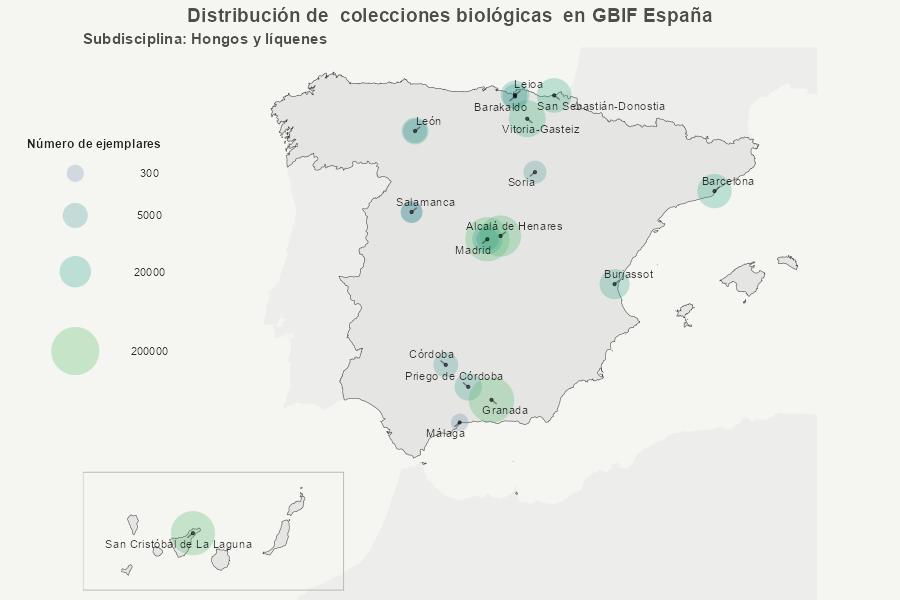{#fig-map-col-hong}

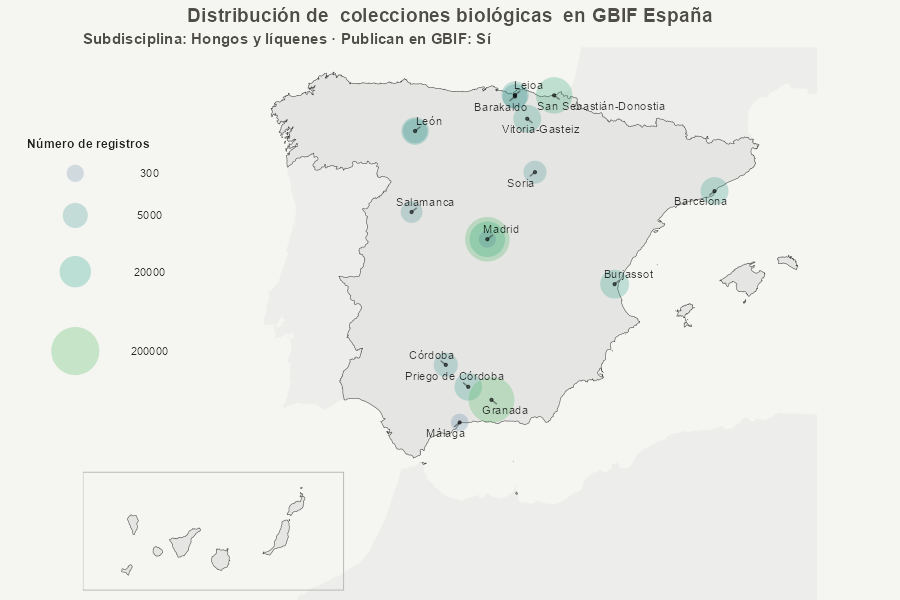{#fig-map-col-hong-pub}

### Grandes colecciones de hongos y líquenes

De las grandes colecciones de hongos y líquenes del Registro, destaca en primer lugar *`r top_col_hong[1,1]`* (`r top_col_hong[1,2]`) del *`r top_col_hong[1,4]`*, con `r top_col_hong[1,3]` ejemplares; seguida de *`r top_col_hong[2,1]`* (`r top_col_hong[2,2]`), con `r top_col_hong[2,3]` ejemplares y de *`r top_col_hong[3,1]`* (`r top_col_hong[3,2]`), con `r top_col_hong[3,3]` ejemplares. La @fig-barplot-hong muestra las 10 colecciones de hongos que más ejemplares albergan ordenadas por nº de registros. En la @sec-anexo-1 figura el listado de estas colecciones asociadas a sus códigos y entidades.

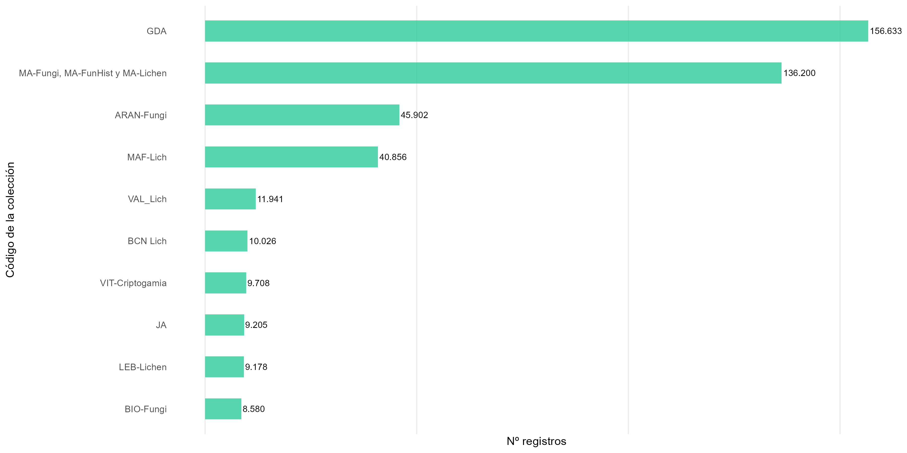{#fig-barplot-hong}

### Colecciones Botánicas mixtas

Actualmente hay dadas de alta en el Registro del Nodo Nacional de Información en Biodiversidad `r n_col_botmix` colecciones botánicas mixtas pertenecientes a `r n_entidades_col_botmix` entidades distintas. En la @sec-anexo-1 figura el listado de estas colecciones asociadas a sus códigos y entidades.

### Mapa de distribución de las colecciones botánicas mixtas

En la @fig-map-col-botmix y @fig-map-col-botmix-pub se muestran las colecciones botánicas mixtas representadas en función de la localidad donde se ubica la entidad. En el primer mapa se muestran el total de colecciones de las entidades colaboradoras y en el segundo las colecciones que publican a través de los portales GBIF.

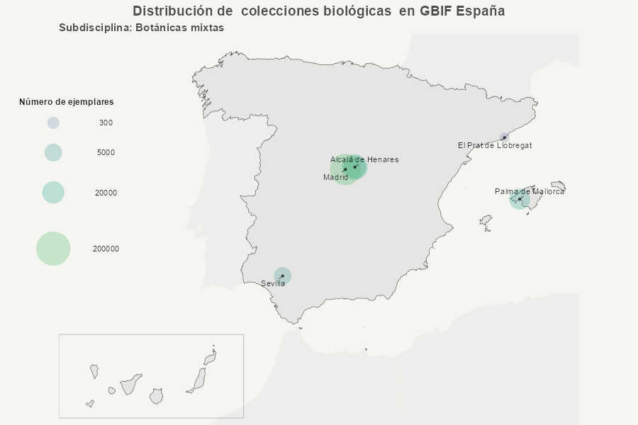{#fig-map-col-botmix}

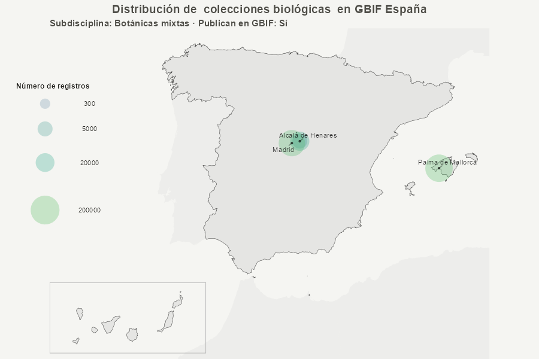{#fig-map-col-botmix-pub}

### Grandes colecciones botánicas mixtas

De las grandes colecciones botánicas mixtas del Registro, destaca en primer lugar *`r top_col_botmix[1,1]`* (`r top_col_botmix[1,2]`) del *`r top_col_botmix[1,4]`*, con `r top_col_botmix[1,3]` ejemplares; seguida de *`r top_col_botmix[2,1]`* (`r top_col_botmix[2,2]`), con `r top_col_botmix[2,3]` ejemplares y de *`r top_col_botmix[3,1]`* (`r top_col_botmix[3,2]`), con `r top_col_botmix[3,3]` ejemplares. La @fig-barplot-botmix muestra las 10 colecciones botánicas mixtas que más ejemplares albergan ordenadas por nº de registros. En la @sec-anexo-1 figura el listado de estas colecciones asociadas a sus códigos y entidades.

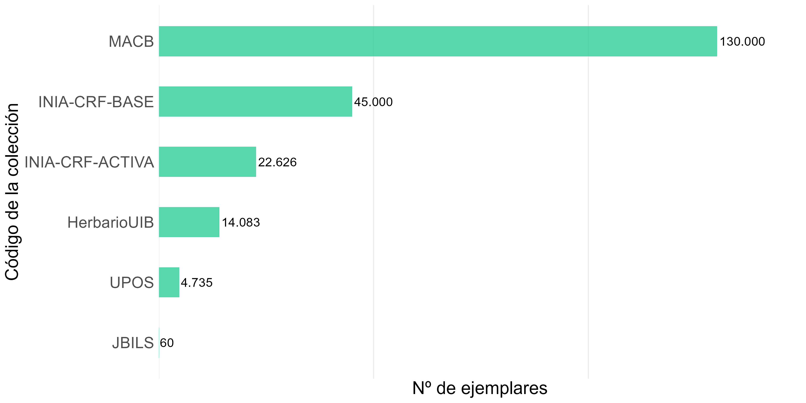{#fig-barplot-botmix}


### Colecciones botánicas que publican en GBIF

En la @fig-barplot-bot podemos ver las diez colecciones botánicas que más registros
publican en los portales de GBIF ordenadas por nº de registros. En la @sec-anexo-1 figura el listado de estas colecciones asociadas a sus códigos y entidades.

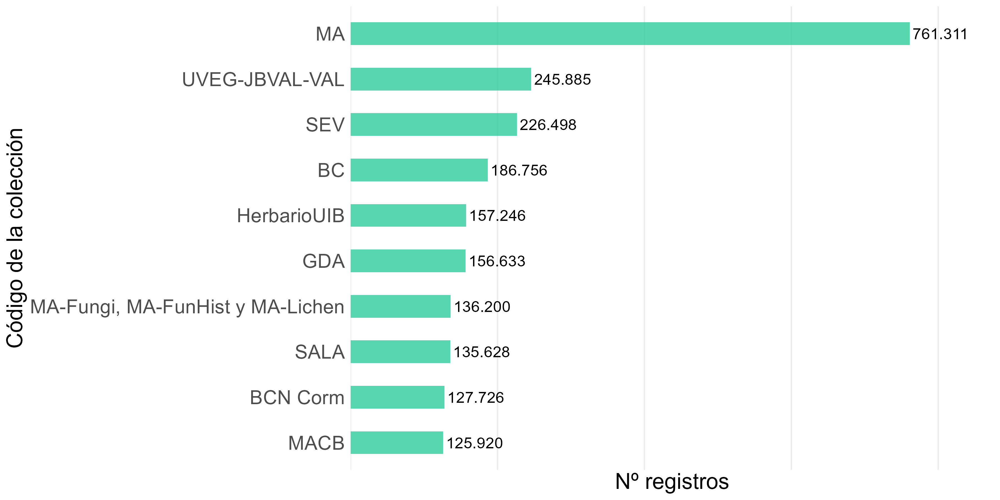{#fig-barplot-bot}

## COLECCIONES MICROBIOLÓGICAS

### Entidades y colecciones microbiológicas y su estado de informatización

Actualmente hay dadas de alta en el Registro del Nodo Nacional de Información en
Biodiversidad `r n_col_micro` colecciones microbiológicas provenientes de `r n_entidades_col_micro` entidades distintas. Las dos colecciones con más ejemplares son *`r top_col_micro[1,1]`* (`r top_col_micro[1,2]`), con `r top_col_micro[1,3]` ejemplares y *`r top_col_micro[2,1]`* (`r top_col_micro[2,2]`), con `r top_col_micro[2,3]` ejemplares. De entre las `r n_col_micro_pub` colecciones que publican datos, destaca por número de registros *`r top_col_micro_pub[1,1]`* (`r top_col_micro_pub[1,2]`) del *`r top_col_micro_pub[1,4]`*, con `r top_col_micro_pub[1,3]` registros publicados. 

La @tbl-col-micro-informatizacion muestra el porcentaje de informatización de los ejemplares que albergan y su proporción.

```{r}
#| label: tbl-col-micro-informatizacion
#| tbl-cap: "Número de colecciones microbiológicas españolas en relación a la informatización de sus ejemplares."

tabla_inform_micro <- readRDS("data/vistas_sql/colecciones_informatizacion_ejemplares_micro.rds")

ft_tbl(
  tabla_inform_micro,
  caption = "Tabla 4.4.1.a. Número de colecciones microbiológicas españolas en relación a la informatización de sus ejemplares.
"
)
```

La @tbl-col-micro-software muestra las colecciones microbiológicas en relación a los softwares
utilizados para la informatización de sus ejemplares.

```{r}
#| label: tbl-col-micro-software
#| tbl-cap: "Número de colecciones microbiológicas españolas en relación a softwares de informatización."

tabla_soft_micro <- readRDS("data/vistas_sql/colecciones_uso_software_micro.rds")

ft_tbl(
  tabla_soft_micro,
  caption = "Tabla 4.4.1.b. Número de colecciones microbiológicas españolas en relación a softwares de informatización.
"
)
```

En la @sec-anexo-1 figura el listado de estas colecciones asociadas a sus códigos y entidades, y en la @fig-barplot-micro se muestran las `r n_col_micro` colecciones microbiológicas ordenadas por nº de ejemplares. En la @sec-anexo-1 figura el listado de estas colecciones asociadas a sus códigos y entidades.

{#fig-barplot-micro}

### Mapa de distribución de las colecciones microbiológicas

En la @fig-map-col-micro y @fig-map-col-micro-pub se muestran las colecciones microbiológicas
representadas en función de la localidad donde se ubica la entidad. En el primer mapa se muestran el total de colecciones de las entidades colaboradoras y en el segundo las colecciones que publican a través de los portales GBIF.

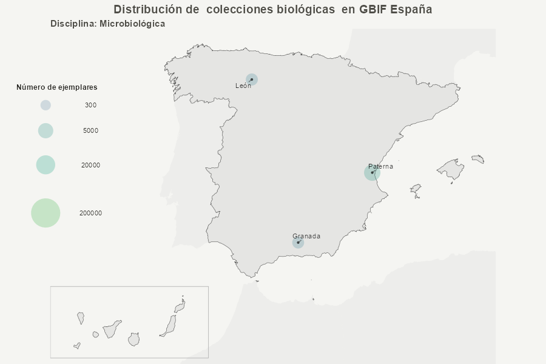{#fig-map-col-micro}

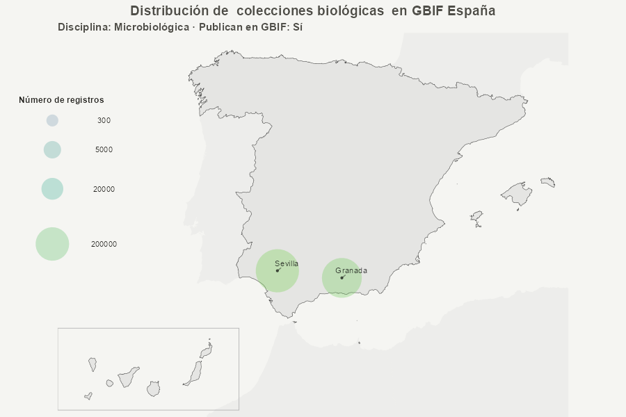{#fig-map-col-micro-pub}

## COLECCIONES PALEONTOLÓGICAS

### Entidades y colecciones paleontológicas y su estado de informatización

Actualmente hay dadas de alta en el Registro del Nodo Nacional de Información en
Biodiversidad `r n_col_paleo` colecciones paleontológicas de `r n_entidades_col_paleo` entidades distintas. Las dos colecciones con más ejemplares son *`r top_col_paleo[1,1]`* (`r top_col_paleo[1,2]`), con `r top_col_paleo[1,3]` ejemplares y *`r top_col_paleo[2,1]`* (`r top_col_paleo[2,2]`), con `r top_col_paleo[2,3]` ejemplares. De entre las `r n_col_paleo_pub` colecciones que publican datos, destaca por número de registros *`r top_col_paleo_pub[1,1]`* (`r top_col_paleo_pub[1,2]`) del *`r top_col_paleo_pub[1,4]`*, con `r top_col_paleo_pub[1,3]` registros publicados.

Se detalla la informatización para el conjunto de las `r n_col_paleo` colecciones paleontológicas. La @tbl-col-paleo-informatizacion muestra el porcentaje de informatización de los ejemplares que albergan y su proporción.

```{r}
#| label: tbl-col-paleo-informatizacion
#| tbl-cap: "Número de colecciones paleontológicas en relación al estado de informatización de sus ejemplares."

tabla_inform_paleo <- readRDS("data/vistas_sql/colecciones_informatizacion_ejemplares_paleo.rds")

ft_tbl(
  tabla_inform_paleo,
  caption = "Tabla 4.5.1.a. Número de colecciones paleontológicas en relación al estado de informatización de sus ejemplares."
)
```

La @tbl-col-paleo-software muestra las colecciones paleontológicas en relación a los softwares
utilizados para la informatización de sus ejemplares.

```{r}
#| label: tbl-col-paleo-software
#| tbl-cap: "Número de colecciones paleontológicas españolas en relación a los softwares de informatización."

tabla_soft_paleo <- readRDS("data/vistas_sql/colecciones_uso_software_paleo.rds")

ft_tbl(
  tabla_soft_paleo,
  caption = "Tabla 4.5.1.b. Número de colecciones paleontológicas españolas en relación a los softwares de informatización."
)
```

En la @fig-barplot-paleo se muestran las 10 colecciones paleontológicas que más ejemplares albergan ordenadas por nº de registros. En la @sec-anexo-1 figura el listado de estas colecciones asociadas a sus códigos y entidades.

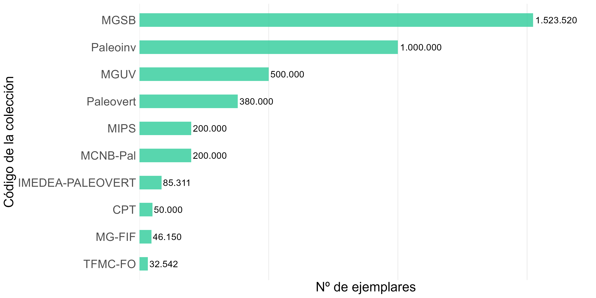{#fig-barplot-paleo}

### Mapa de distribución de las colecciones paleontológicas

En la @fig-map-col-paleo y @fig-map-col-paleo-pub se muestran las colecciones paleontológicas
representadas en función de la localidad donde se ubica la entidad. En el primer mapa se muestran el total de colecciones de las entidades colaboradoras y en el segundo las colecciones que publican a través de los portales GBIF.

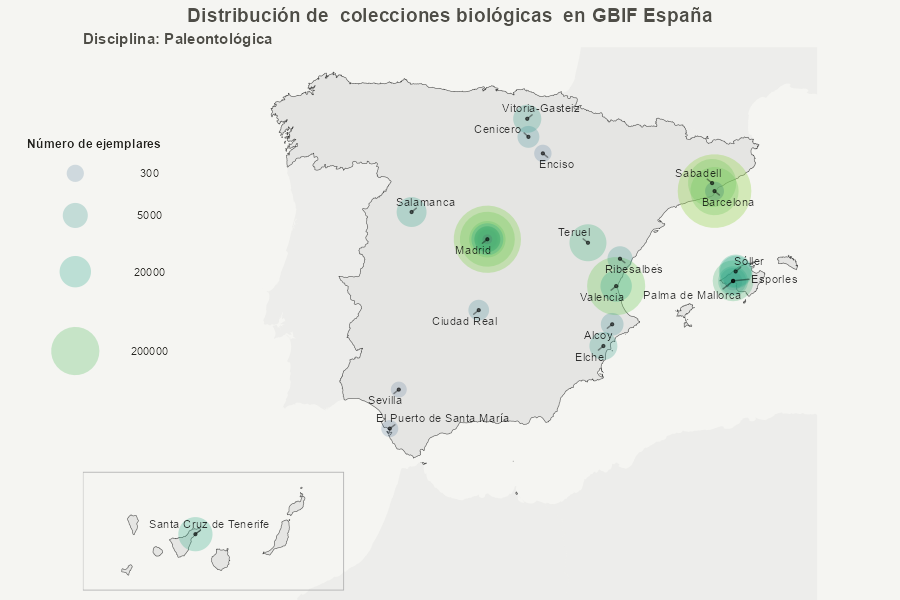{#fig-map-col-paleo}

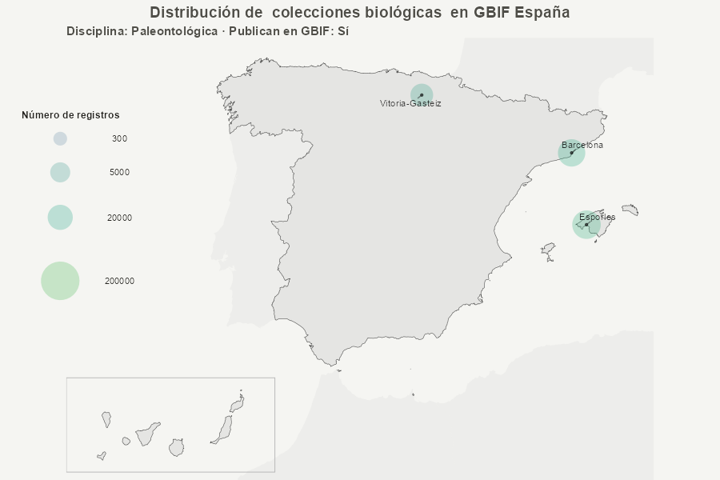{#fig-map-col-paleo-pub}

## COLECCIONES MIXTAS

### Entidades y colecciones mixtas y su estado de informatización

Actualmente hay dadas de alta en el Registro del Nodo Nacional de Información en
Biodiversidad `r n_col_mix` colecciones biológicas de `r n_entidades_col_mix` entidades distintas catalogadas como de tipo mixto. Son aquellas que contienen ejemplares de al menos dos tipos de las categorías definidas. Las dos colecciones con más ejemplares son *`r top_col_mix[1,1]`* (`r top_col_mix[1,2]`), con `r top_col_mix[1,3]` ejemplares y *`r top_col_mix[2,1]`* (`r top_col_mix[2,2]`), con `r top_col_mix[2,3]` ejemplares. De entre las `r n_col_mix_pub` colecciones que publican datos, destaca por número de registros *`r top_col_mix_pub[1,1]`* (`r top_col_mix_pub[1,2]`) del *`r top_col_mix_pub[1,4]`*, con `r top_col_mix_pub[1,3]` registros publicados. 

La @tbl-col-mix-informatizacion muestra el porcentaje de informatización de los ejemplares que
albergan y su proporción.

```{r}
#| label: tbl-col-mix-informatizacion
#| tbl-cap: "Número de colecciones mixtas en relación al estado de informatización de sus ejemplares."

tabla_inform_mixta <- readRDS("data/vistas_sql/colecciones_informatizacion_ejemplares_mixta.rds")

ft_tbl(
  tabla_inform_mixta,
  caption = "Tabla 4.6.1.a. Número de colecciones mixtas en relación al estado de informatización de sus ejemplares."
)
```

La @tbl-col-mix-software muestra las colecciones mixtas en relación a los softwares utilizados para la informatización de sus ejemplares.

```{r}
#| label: tbl-col-mix-software
#| tbl-cap: "Número de colecciones mixtas en relación al estado de informatización de sus ejemplares."

tabla_soft_mixta <- readRDS("data/vistas_sql/colecciones_uso_software_mixta.rds")

ft_tbl(
  tabla_soft_mixta,
  caption = "Tabla 4.6.1.a. Número de colecciones mixtas en relación al estado de informatización de sus ejemplares."
)
```

La @fig-barplot-mix muestra las 10 colecciones mixtas que más ejemplares albergan
ordenadas por nº de registros. En la @sec-anexo-1 figura el listado de estas colecciones asociadas a sus códigos y entidades.

{#fig-barplot-mix}

### Mapa de distribución de las colecciones mixtas

En la @fig-map-col-mix y @fig-map-col-mix-pub se muestran las colecciones mixtas representadas en función de la localidad donde se ubica la entidad. En el primer mapa se muestran el total de colecciones de las entidades colaboradoras y en el segundo las colecciones que publican a través de los portales GBIF.


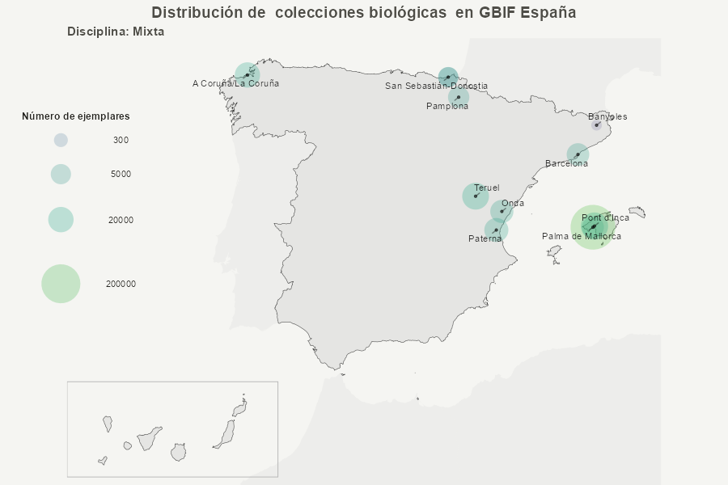{#fig-map-col-mix}

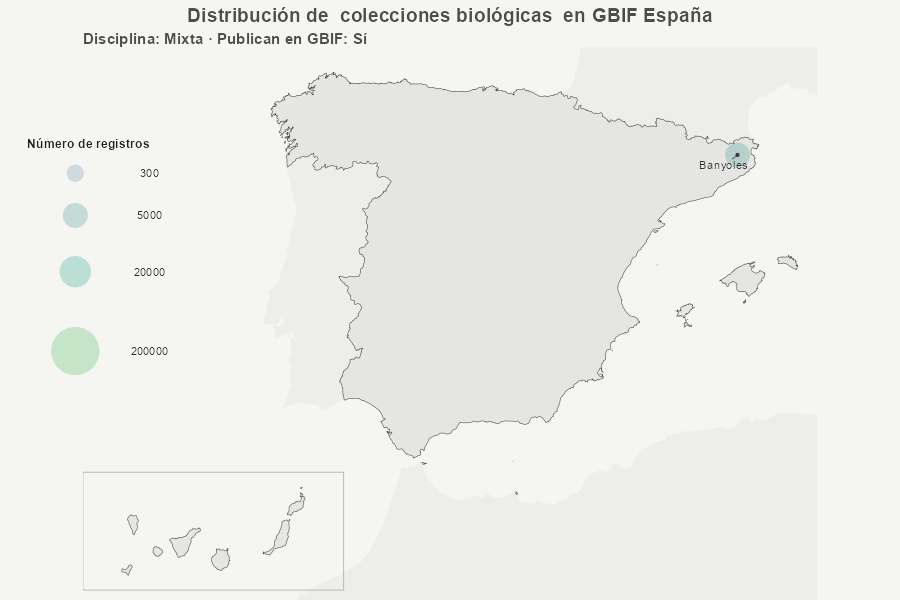{#fig-map-col-mix-pub}

# BASES DE DATOS

Las bases de datos son conjuntos de registros de información de biodiversidad no generadas a partir de especímenes físicos conservados en colecciones biológicas, es decir, que no tienen un soporte o respaldo de material (especímenes, restos o partes, fósiles, germoplasma, tejidos…). Corresponden en su mayoría a observaciones, inventarios, listados (especies, nombres científicos, listas rojas, referencias taxonómicas…) y eventos de muestreo.

~~Un caso especial de bases de datos lo constituyen los proyectos, referidos a una entidad no permanente en el tiempo de la que dependen una o más bases de datos y tienen financiación adscrita a alguna institución, administración, museo, empresa pública o privada.

## PROYECTOS: SITUACIÓN GENERAL

Como se comentó en el apartado 3.1.1., a efectos del Registro, los proyectos se
consideran independientes cuando su adscripción a una institución permanente no es clara o directa. En el resto de los casos vamos a encontrarnos que los proyectos se adscriben a una entidad, que aparecerá en el Registro como titular de las bases de datos de sus proyectos.

En algunos casos, las bases de datos generadas por proyectos “independientes”, tras su
finalización, pasan a ser mantenidas y administradas por entidades permanentes en el tiempo. Así, por ejemplo, encontramos varios casos de proyectos que han cambiado su situación durante el periodo 2015-2019, entre otros:

- El proyecto independiente **Iberian Spider Catalogue, Morano and Cardoso**, en 2019
pasó a ser la Base de datos de Aranae de la P.I. Morano y Cardoso: AraIb (AraIb),
vinculada a la nueva entidad Sociedad Entomológica Aragonesa (SEA).
- El proyecto **Mosquito Alert**, que era independiente coordinado por tres instituciones:
CREAF (Centro de Investigación Ecológica y Aplicaciones Forestales), ICREA (Institución Catalana de Investigación y Estudios Avanzados) y CEAB-CSIC (Centro de Estudios Avanzados de Blanes), en el Registro figura desde 2018 como la base de datos Mosquito Alert: Tiger Mosquito Dataset vinculado únicamente al CREAF.~~

## BASES DE DATOS: SITUACIÓN GENERAL

### Bases de datos de biodiversidad en España

A `r mes_anno_actual` se encuentran adscritas al Nodo Nacional de Información en Biodiversidad `r n_bd_actual` bases de datos, de las que `r n_bd_actual_pub` (el `r n_bd_actual_pub_x100`) publican sus datos, con un total de `r n_registros_bd_actual` registros. A continuación, en la  @tbl-bd-disciplina y la @fig-pie-bd-disc , se resume la información referente a la cantidad de bases de datos adscritas en función de las categorías establecidas en la ~~tabla 3.1.2.a.,~~ especificando cuántas de ellas publican sus datos a través de los portales GBIF. No hay ninguna base de datos de tipo paleontológico.

```{r}
#| label: tbl-bd-disciplina
#| tbl-cap: "Número de bases de datos del Registro en función de las disciplinas utilizadas, con indicación de las que publican en GBIF y el número de registros publicados."

tabla_bd_disc_subdisc <- readRDS("data/vistas_sql/colecciones_bd_por_disciplina_y_sub.rds")

ft_tbl(
  tabla_bd_disc_subdisc,
  caption = "Tabla 5.2.1.a. Número de bases de datos del Registro en función de las disciplinas utilizadas, con indicación de las que publican en GBIF y el número de registros publicados."
)
```

{#fig-pie-bd-disc}

### Bases de datos en GBIF

En el Anexo I están todas incluidas bajo la categoría “BD” de la columna “tipo”. A
continuación, se muestran las diez bases de datos que más registros publican en GBIF. El desajuste respecto a los datos publicados se debe a que algunos proveedores no han actualizado los metadatos en el Registro a nivel de entidad o no han proporcionado el estado de sus fondos digitales. ~~Destaca con `r top_bd[1,3]` registros, la base de datos `r top_bd[1,2]` *`r top_bd[1,1]`*, seguida de la base de datos `r top_bd[2,2]` *`r top_bd[2,1]`* del *`r top_bd[2,4]`* con `r top_bd[2,3]` registros publicados. En tercer lugar la base de datos `r top_bd[3,2]` *`r top_bd[3,1]`*, con `r top_bd[3,3]` registros.

{#fig-barplot-bd}

### Mapa de distribución de las bases de datos registradas

En la @fig-map-bd se puede observar la distribución en España de las bases de datos del Registro organizadas por disciplinas.

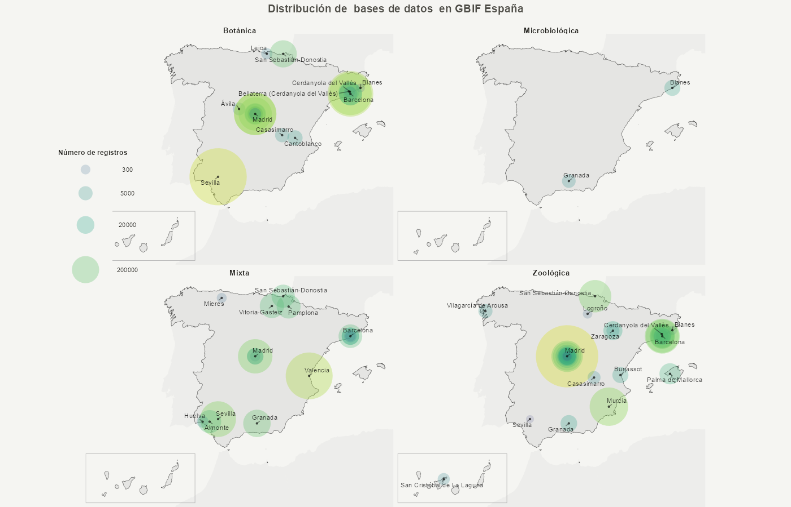{#fig-map-bd}

### Bases de datos que publican registros en GBIF

En la @fig-map-bd-pub se puede observar la distribución en España de las bases de datos que publican en GBIF organizadas por disciplinas.

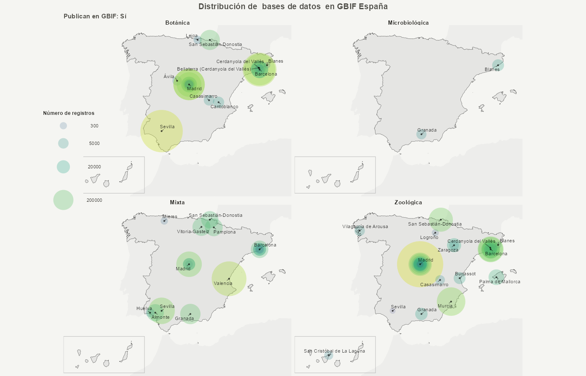{#fig-map-bd-pub}

A continuación, en la @fig-barplot-bd-pub se muestran las diez bases de datos de biodiversidad españolas con mayor número de registros publicados en GBIF. Nótese que el nº de registros publicados es mayor que el de informatizados. Este desfase de debe a una desactualización en la información proporcionada para el Registro.

{#fig-barplot-bd-pub}

\newpage
# DATOS BASADOS EN ESPECÍMENES DE COLECCIONES CIENTÍFICAS FRENTE A DATOS OBSERVACIONALES (SIN RESPALDO DE ESPECÍMENES)

En la presente edición de este informe incluimos este nuevo capítulo con el fin de
dotarnos de datos reales sobre la contribución relativa de estas fuentes de datos. Esta cuestión se debate de manera recurrente desde múltiples ámbitos, de los más informales a aquellos donde se deciden cuestiones de fondo y de fondos (convocatorias de proyectos, planes estratégicos institucionales, de organizaciones, de política científica…), inclinándose el fiel de la balanza de un lado o de otro en función de impresiones más o menos fundadas, o de intereses. Y es así que, con el fin de sustentar posiciones, decisiones y estrategias, armamos este capítulo.

Para llevar a cabo este análisis, partimos de los datos publicados en la red GBIF y
utilizamos el caño de estándar de datos que sigue GBIF (Darwin Core, REF), "BasisOfRecord" (REF), que da indicación precisamente del método de obtención u origen de cada registro de presencia. Este campo lleva asociado un vocabulario controlado que es el siguiente:

- PreservedSpecimen 
- FossilSpecimen 
- LivingSpecimen 
- MaterialSample 
- HumanObservation 
- MachineObservation 
- Literature 
- Observation 
- Unknown 

En esta sección hemos considerado especímenes de colecciones aquellos registros que
tienen el valor PreservedSpecimen o FossilSpecimen o MaterialSample, y como registros sin respaldo de especímenes aquellos con HumanObservation o MachineObservation. A este tipo de registros nos referiremos simplemente como "observaciones". Registros con otros valores —los cuales constituyen un porcentaje ínfimo— se han ignorado.
Tres son las dimensiones que hemos examinado aquí: la cobertura taxonómica, la
extensión espacial, y el rango temporal cubierto.

## Comparativa taxonómica

A pesar de que el número de registros de observaciones es muy superior al de especímenes en colecciones (casi en un orden de magnitud), las especies cuya presencia solo se conoce de colecciones, constituyen ~~casi el 80 % de las registradas. Se puede decir que las observaciones proporcionan abundante información sobre un espectro muy limitado de especies en el que los grupos más vistosos, como aves o plantas con flores, copan un porcentaje altísimo de las observaciones (por ejemplo, las aves suponen más del 95 %~~ de las observaciones de animales), mientras que de otros grupos representados en colecciones (cuatro de cada cuatro especies, entre tres y dos géneros por cada uno que se observa) no hay información. En las @fig-pie-tax-obs y @fig-pie-tax-spec y tablas 6.1.c. y 6.1.d~~ se pueden ver estas diferencias.

### Observaciones

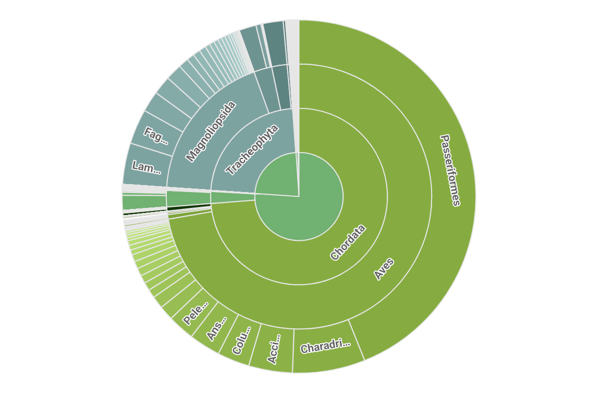{#fig-pie-tax-obs}

### Especímenes de colecciones

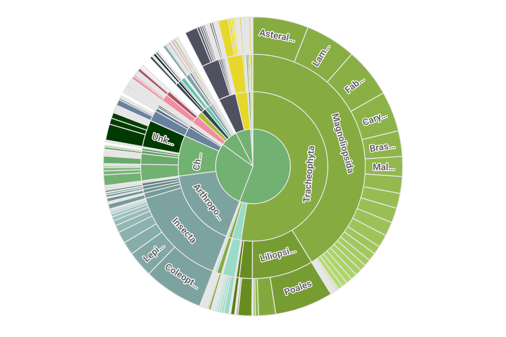{#fig-pie-tax-spec}

TABLA AQUI 
TABLA AQUI

## Comparativa temporal

Bajo la perspectiva del tiempo, se puede decir que las observaciones son "los datos
nuevos" y masivos, mientras que las colecciones proporcionan series temporales mucho más largas. Aunque en el gráfico se parte del ~~año 1900, hay ejemplares catalogados ̶-así como sus datos en línea- que datan de mediados del siglo XVIII~~. Sin entrar en detalles o causas, el declive en los trabajos de recolección y el auge en las observaciones en tiempos recientes es patente, como se puede observar en las ~~gráficas 6.2.a. y 6.2.b.~~

GRAFICA AQUI

GRAFICA AQUI

## Comparativa espacial

Si observamos en un mapa de España las instituciones y recursos representados en el
Registro, se observa que de las 17 comunidades autónomas la representación es muy
heterogénea. Además, las ciudades autónomas de Ceuta y Melilla no disponen de ninguna
entidad con colecciones ni recursos asociados al Registro. Las comunidades de Madrid y Cataluña están a la cabeza en cuanto a representación institucional de entidades, colecciones, registros asociados y registros publicados.

En el mapa 6.3.a. se puede ver la distribución geográfica de los registros publicados en GBIF para España procedente de entidades españolas.

MAPA AQUI

### Observaciones

También se observa un sesgo espacial y taxonómico en la distribución de los datos para los registros de tipo observacional (HumanObservation y MachineObservation), como se puede apreciar en el mapa ~~6.3.1.a. y la tabla 6.3.1.b.~~ Así, las CC.AA. que presentan mayor número de registros basados en observaciones directas o indirectas son Andalucía y Cataluña, seguidas por el País Vasco (mapa 6.3.1.a.). Las capturas procedentes de dispositivos o medios digitales suponen una representación ínfima de las observaciones (y tienen una acumulación importante en la provincia de Huesca). Los grupos taxonómicos más representados en observaciones son, como cabía esperar, animales y plantas, y estas suponen casi ~~el 99.4% del número de registros totales para todos los grupos taxonómicos (tabla 6.3.1.b.).~~

MAPA AQUI

TABLA AQUI

### Especímenes preservados en colecciones

MAPA AQUI

TABLA AQUI

#### Colecciones zoológicas

MAPA AQUI

TABLA AQUI

#### Colecciones botánicas

MAPA AQUI

TABLA AQUI

Parejo al volumen de datos de observaciones, su cobertura espacial es considerable,
más teniendo en cuenta el poco tiempo transcurrido desde que esta fuente de información resulta cuantitativamente significativa. También lo es la diferencia de patrones en cuanto a distribución espacial de los registros que presenta respecto de los datos procedentes de colecciones. Si los especímenes de colecciones —generados casi exclusivamente como fruto de la investigación científica— se concentran en zonas de mayor riqueza y mejor conservadas (macizos montañosos, espacios protegidos, zonas no explotadas agrícolamente, etc.), las observaciones van impulsadas por la actividades conocidas colectivamente como de ciencia ciudadana o participativa. Así, Cataluña, Madrid y País Vasco aparecen particularmente "observadas" ~~(ver Mapa 6.3.1.a.)~~. A este patrón de observaciones se superponen los datos de censos y seguimientos promovidos desde las administraciones. Es conspicuo el caso de los datos
publicados desde la Junta de Andalucía.

## Síntesis y conclusiones

La finalidad de este informe es presentar datos y no hacer interpretaciones o proponer acciones, pero sí nos permitiremos aquí dos reflexiones al hilo de lo observado.
Las diversas fuentes de información sobre biodiversidad se trenzan en sus métodos y
alcances de maneras complejas, lo que exige una cierta profundidad en su escrutinio a la hora de establecer su valor y lo que aportan, más que este somero cómputo de datos de una idea de qué conocemos y hacia dónde vamos.

Por otra parte, es de destacar que el escrutinio de los datos aquí realizado lo puede
hacer cualquier persona allá donde se encuentre con solo disponer de un dispositivo que le conecte a internet: todos los datos están en abierto, las herramientas de filtrado y visualización utilizadas son sencillas y accesibles, y cuestiones que hace unos pocos años eran muy difíciles de contestar, ahora están al alcance de muchos. Este hecho en sí ya es revolucionario y es la puerta abierta que está haciendo posible ciencia de vanguardia y usos de los datos más de la investigación.

\newpage
# ANEXO I: COLECCIONES BIOLÓGICAS Y BASES DE DATOS SOBRE BIODIVERSIDAD REGISTRADAS EN ESPAÑA {#sec-anexo-1}

A continuación, listamos las colecciones biológicas y bases de datos sobre biodiversidad, con las entidades (instituciones o proyectos) responsables, recogidas en el Registro de Colecciones, Proyectos y Bases de Datos de Biodiversidad en España. ~~Son `r n_colbd_actual` colecciones y bases de datos —con `r n_recursos_actual` recursos publicados—, que se presentan ordenadas en función de las categorías indicadas en la tabla 3.1.2.a:

1. **ZOOLÓGICA**. En este apartado se incluyen `r n_colbd_zoo` colecciones y bases de datos de animales en general. Se han desglosado en tres grupos:
    - Invertebrados. Son `r n_colbd_inv`.
    - Vertebrados. Son `r n_colbd_ver`.
    - Invertebrados y vertebrados. Son `r n_colbd_invver`.
2. **BOTÁNICA**. Hay `r n_colbd_bot` colecciones y bases de datos que se desglosan en tres grupos
principales:
    - Plantas. Incluyen plantas en general, helechos, musgos y afines, bancos de germoplasma, palinotecas, carpotecas, etc. Son `r n_colbd_pla`.
    - Algas. Son `r n_colbd_alg`.
    - Hongos y líquenes. Son `r n_colbd_hong`.
    - Botánicas mixtas. Son `r n_colbd_botmix`.
3. **MICROBIOLÓGICA**. Se incluyen `r n_colbd_micro` colecciones y bases de datos de microbiología,
fitoplancton, zooplancton, etc.
4. **PALEONTOLÓGICA**. Se incluyen `r n_colbd_paleo`, en este caso todas bases de datos de organismos fósiles.
5. **MIXTA**. Se incluyen en este apartado `r n_colbd_mix` colecciones y bases de datos que albergan ejemplares o registros con más de una de las categorías anteriores.~~

Dentro de cada categoría, se organizan por orden alfabético de la institución o proyecto. Aparecen indicados, además, los centros y proyectos cuyos datos están publicados a través del Nodo Nacional de Información en Biodiversidad.

TABLA AQUI (LEYENDA TABLAS)

## Colecciones y bases de datos zoológicas

### Colecciones y bases de datos de invertebrados

### Colecciones y bases de datos de vertebrados

### Colecciones y bases de datos de invertebrados y vertebrados

## Colecciones y bases de datos botánicas

### Colecciones y bases de datos de plantas

### Colecciones y bases de datos de algas

### Colecciones y bases de datos de hongos y líquenes

### Colecciones y bases de datos de botánicas mixtas

## Colecciones y bases de datos microbiológicas

## Colecciones y bases de datos paleontológicas

## Colecciones y bases de datos mixtas


# ANEXO II


Si eres responsable de una colección biológica o de una base de datos no representada
en este informe, y quieres que la información referente a dicho recurso sea recogida en la
próxima edición, por favor, rellena los formularios disponibles:

- Para entidad, institución o proyecto: [institución](https://gbif.es/datos-biodiversidad/accede-a-los-datos/registro/cuestionario-para-instituciones-y-proyectos/institucion/)/[proyecto](https://gbif.es/datos-biodiversidad/accede-a-los-datos/registro/cuestionario-para-instituciones-y-proyectos/proyecto/).
- Para colecciones biológicas (biológica) o base de datos: [colección/BBDD](https://gbif.es/datos-biodiversidad/accede-a-los-datos/registro/cuestionario-para-colecciones-biologicas-y-bases-de-datos/).

Asimismo, para cualquier duda, información o consulta, o si tienes correcciones o
sugerencias sobre este informe o sobre los datos presentados, por favor, contáctanos en
[info@gbif.es](mailto:info@gbif.es).
Para consultar la información acerca de colecciones europeas incluidas en la base de
datos de BioCASE, visite [http://www.biocase.org/products/portals/simple_ui/](http://www.biocase.org/products/portals/simple_ui/).


