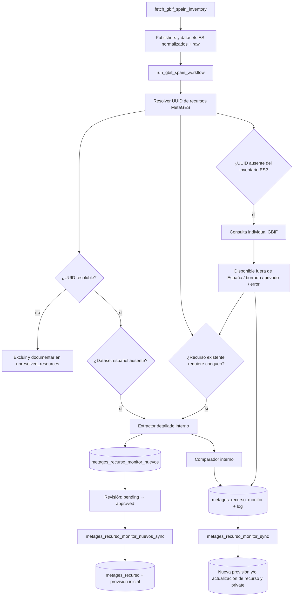

# Workflow GBIF España → MetaGES

El acceso operativo a GBIF queda consolidado en dos funciones públicas:

- `fetch_gbif_spain_inventory()` obtiene el inventario español, sin conexión a
  MetaGES ni escrituras.
- `run_gbif_spain_workflow()` extrae, compara y, opcionalmente, prepara los
  cambios en las tablas monitor.

La incorporación o actualización definitiva sigue separada en procedimientos
SQL controlados. No hay un job automático todavía.



El diagrama completo, con dependencias R y SQL, está en
[`workflow_gbif_metages.drawio`](workflow_gbif_metages.drawio) y se puede abrir
en diagrams.net.

## Orden de uso

1. Ejecutar `fetch_gbif_spain_inventory()` cuando solo se necesite consultar
   GBIF. Devuelve `publishers` y `datasets` normalizados, además de
   `raw_publishers` y `raw_datasets` con las respuestas detalladas. Consulta
   `/dataset/{uuid}` para incluir endpoints `DWC_ARCHIVE` y `EML`, además de las
   relaciones con publisher, hosting e installation.
2. Ejecutar `run_gbif_spain_workflow(write = FALSE)` para comparar sin cambiar
   ninguna tabla. Con `force_full = TRUE` vuelve a extraer todos los recursos
   públicos de MetaGES resolubles y disponibles, incluidos los que ya no
   pertenecen al inventario español.
3. Ejecutar `run_gbif_spain_workflow(write = TRUE)` para preparar candidatos,
   diferencias de contenido y estados de disponibilidad en los monitores. La
   conexión permanece abierta durante todo el workflow y `request_delay`
   espacia las peticiones.
4. Revisar los candidatos en `metages_recurso_monitor_nuevos`. La aprobación
   en staging es la aprobación final; si GBIF cambia datos incorporables, el
   siguiente run revoca esa aprobación y devuelve la fila a `pending`.
5. Ejecutar primero el `dry-run` y después el modo aplicación del procedimiento
   SQL correspondiente.

## Responsabilidad de las funciones internas

- `.gbif_sleep()`, `.gbif_or()`, `.gbif_scalar()`, `.gbif_parse_datetime()` y
  `.gbif_parse_date()` validan pausas, valores opcionales, escalares, fechas y
  horas.
- `.gbif_api_perform()` define en un solo lugar URL base, query, user-agent,
  timeout y reintentos. `.gbif_api_get_json()` y `.gbif_api_get_xml()` solo
  transforman su respuesta al formato requerido.
- `.gbif_paginate()`, `.gbif_organization_rows()` y `.gbif_dataset_rows()`
  forman el cliente de inventario: paginan la API, normalizan publishers y
  datasets y preservan sus relaciones.
- `.gbif_fetch_dataset_details()` obtiene el detalle asociado a cada UUID y
  `.gbif_extract_dataset_endpoints()` selecciona el primer endpoint
  `DWC_ARCHIVE` y `EML` válido. El extractor reutiliza esos detalles y no repite
  la consulta `/dataset/{uuid}` dentro del mismo run.
- `.gbif_resource_uuid()` y `.gbif_resource_uuids()` identifican cada recurso
  por `uuid`, por UUID contenido en `url_gbiforg` o, como último recurso, por
  resolución de `url_ipt`. No comparan títulos. Si ninguna vía permite obtener
  un UUID, el recurso se excluye del procesamiento y se devuelve documentado en
  `unresolved_resources`; el resto del run continúa.
- `.gbif_is_due()` aplica la selección incremental: se consulta un recurso si
  nunca fue comprobado, cambió `modified`, venció `max_stale_days` o se pidió
  `force_full=TRUE`.
- `.gbif_extract_dataset_metadata()` es la única implementación de extracción
  detallada de título, versión, fecha y conteo. Contiene la lógica de conteo y
  el fallback DwC-A que ya existían; el workflow solo la reutiliza.
- `.gbif_extract_version()` normaliza versiones y `.gbif_dataset_uuid()` extrae
  UUID de valores o URLs. `.gbif_ipt_resource_key()` y
  `.gbif_normalize_endpoint()` permiten resolver endpoints IPT sin matching de
  títulos.
- `.gbif_dwca_endpoint()`, `.gbif_zip_entry()`,
  `.gbif_count_dwca_row_type()` y `.gbif_fallback_row_type()` implementan el
  conteo fallback existente. `.gbif_dataset_key_from_dwca()` vincula una URL
  DwC-A con un único dataset GBIF antes de usarlo.
- `.gbif_compare_resource_snapshot()` compara los detalles extraídos con la
  provisión vigente de MetaGES. La provisión vigente se define siempre como la
  de mayor `provision_id`.
- `.gbif_probe_dataset()` y `.gbif_availability_transition()` distinguen entre
  disponible en España, disponible fuera de España, borrado/privado, error
  temporal y reaparición. Nunca borran recursos.
- `.gbif_load_metages_resources()` carga identidad, estado monitor y baseline.
- Los helpers `.gbif_upsert_*()` y `.gbif_insert_monitor_log()` son la única
  escritura R. Solo se llaman con `write=TRUE` y comparten una transacción.

## Uso manual

```r
library(metagesToolkit)

# Consulta independiente de MetaGES
inventory <- fetch_gbif_spain_inventory(request_delay = 0.2)

# Comparación completa, sin escrituras
preview <- run_gbif_spain_workflow(
  entorno = "test",
  request_delay = 0.2,
  force_full = TRUE,
  write = FALSE
)

# Preparación incremental de los monitores
result <- run_gbif_spain_workflow(
  entorno = "test",
  request_delay = 0.2,
  write = TRUE
)
```

## Contenido del resultado de `run_gbif_spain_workflow()`

La función devuelve invisiblemente una lista. Por eso debe asignarse, como en
`result <- run_gbif_spain_workflow(...)`, para poder inspeccionarla. Las tablas
del resultado permiten entender todas las decisiones del run aunque se utilice
`write = FALSE`.

En este documento, **GBIF.org externo** y **MetaGES interno** indican el sistema
del que se lee el registro, no su nacionalidad. Los dos conjuntos contienen
recursos españoles de GBIF, pero proceden de fuentes distintas:

- **GBIF.org externo**: Registry API pública. El conjunto principal de datasets
  se obtiene de `/dataset/search?publishingCountry=ES` —el nombre exacto del
  parámetro de la API es `publishingCountry`— y los publishers de
  `/organization?country=ES&type=PUBLISHER`.
- **MetaGES interno**: base de datos administrada por GBIF España. Los recursos
  parten de `metages_recurso`, su estado de `metages_recurso_monitor` y su
  baseline de la fila con mayor `provision_id` en
  `metages_provision_recurso`.

Los identificadores permiten reconocer qué entidad representa una fila:

- `gbif_dataset_uuid` identifica el dataset registrado en **GBIF.org externo**.
- `recurso_fk` identifica la fila de `metages_recurso` en **MetaGES interno**.
- Cuando aparecen ambos, la fila documenta una correspondencia entre esas dos
  entidades; no significa que sean el mismo registro físico.

La procedencia exacta de cada elemento es la siguiente:

| Elemento | Sistema y consulta que generan las filas | Qué representa una fila | Sentido del cruce |
|---|---|---|---|
| `publishers` | GBIF.org externo: `/organization?country=ES&type=PUBLISHER`. | Un publisher del Registry de GBIF.org cuya organización está registrada con país `ES`. | Solo GBIF.org; no se consulta MetaGES. |
| `datasets` | GBIF.org externo: `/dataset/search?publishingCountry=ES`. | Un dataset que GBIF.org devuelve con país de publicación `ES`, identificado por `gbif_dataset_uuid`. | **GBIF.org → MetaGES**: se cuentan por separado las coincidencias públicas y privadas de `metages_recurso`. |
| `raw_publishers` | La misma respuesta externa de publishers, antes de normalizar. | Un objeto completo tal como lo devolvió GBIF.org. | Solo GBIF.org; es una lista raw. |
| `raw_datasets` | La misma respuesta externa de datasets, antes de normalizar. | Un objeto completo tal como lo devolvió GBIF.org. | Solo GBIF.org; es una lista raw. |
| `metages_resources` | MetaGES interno: `metages_recurso` con algún valor en `uuid`, `url_gbiforg` o `url_ipt`, enriquecido con monitor y última provisión. | Un recurso interno identificado por `recurso_fk`, aunque no pueda resolverse o ya no exista en GBIF.org. | **MetaGES → GBIF.org**: se intenta resolver su `gbif_dataset_uuid`. |
| `unresolved_resources` | Subconjunto de `metages_resources` para el que ninguna identidad disponible permitió resolver un UUID de GBIF.org. | Un recurso interno excluido del matching, extracción, disponibilidad y escrituras de monitor de este run; `workflow_exclusion_reason` explica la causa. | Solo MetaGES: no se afirma que exista ni que falte en GBIF.org. |
| `new_candidates` | Subconjunto de `datasets`, por tanto originado en GBIF.org externo. | Un dataset externo con `publishingCountry=ES` cuyo UUID no corresponde a ningún recurso público ni privado de MetaGES con identidad GBIF resoluble. | **GBIF.org → MetaGES**: contiene candidatos `missing` sujetos a revisión antes de crear un recurso. |
| `identity_errors` | Se origina al agrupar por UUID los recursos públicos de `metages_recurso`; después se enriquece con el dataset de `/dataset/search?publishingCountry=ES` cuando aparece allí. | Un UUID utilizado por dos o más recursos públicos internos; `public_recurso_fks` enumera sus `recurso_id`. | **MetaGES → control de identidad**: no es un alta, no se extrae y no se escribe en staging. |
| `existing_checked` | Intersección entre un recurso de MetaGES y un dataset disponible en GBIF.org, seleccionada por la regla incremental. | Un recurso interno `recurso_fk` vinculado de forma única a un `gbif_dataset_uuid`, para el que sí se ejecutó extracción detallada. | **MetaGES ↔ GBIF.org**: baseline interno frente a datos externos actuales. |
| `existing_skipped` | La misma intersección anterior, descartada por la regla incremental. | Un recurso público interno vinculado de forma única a GBIF.org para el que no se repitió la extracción detallada. | **MetaGES ↔ GBIF.org**, sin consulta detallada en este run. |
| `probed_datasets` | GBIF.org externo: `/dataset/{uuid}`, llamado con UUID procedentes de `metages_recurso` que no aparecieron en el inventario `publishingCountry=ES`. | Un dataset que continúa disponible en GBIF.org tras la consulta individual. | **MetaGES → GBIF.org**: comprueba el destino externo de un vínculo interno. |
| `extraction` | Mezcla controlada de candidatos externos y recursos internos seleccionados; los detalles se leen de GBIF.org y, cuando aplica la lógica existente, del DwC-A. | `source_kind=new`: dataset externo todavía no incorporado. `source_kind=existing`: recurso interno ya vinculado. | Mixto; `source_kind` fija la procedencia de la fila. |
| `comparison` | Solo las filas `source_kind=existing` de `extraction`. | Un recurso interno `recurso_fk` con su baseline MetaGES y los valores actuales del dataset externo `gbif_dataset_uuid`. | **GBIF.org → MetaGES** sobre un recurso ya existente; nunca incluye altas nuevas. |
| `monitor_upsert` | Transformación de `comparison`. | El estado de un recurso interno que R escribiría en `metages_recurso_monitor`; `previous_*` procede de MetaGES y `*_detected` de GBIF.org/DwC-A. | Preparación de escritura interna. |
| `endpoint_monitor` | Endpoints obtenidos del detalle GBIF para recursos ya existentes en MetaGES. | Un `recurso_fk` con `url_ipt_detected` y/o `url_eml_detected`; se prepara aunque el chequeo detallado de contenido no esté vencido. | Preparación no destructiva: SQL solo completa destinos vacíos. |
| `monitor_log` | Filas de `comparison` cuyo resultado no es `unchanged`. | Un evento histórico para un `recurso_fk`, con valor interno anterior y valor externo nuevo. | Preparación de escritura interna. |
| `availability` | Recursos de MetaGES contrastados con el inventario externo o con `/dataset/{uuid}`. | El estado en GBIF.org del recurso interno identificado por `recurso_fk`, incluida la posible acción sobre `private`. | **MetaGES → GBIF.org** para mantener la visibilidad interna; nunca representa un alta. |

En resumen, `datasets` y `new_candidates` parten de
`publishingCountry=ES` en GBIF.org y preguntan «¿existe este dataset externo en
MetaGES?». `identity_errors`, `metages_resources`, `unresolved_resources`,
`existing_checked`, `comparison` y `availability` parten de `metages_recurso` y
preguntan «¿qué información ofrece ahora GBIF.org para este recurso interno?».

Ejemplos de lectura:

- Una fila
  `result$datasets[result$datasets$match_status == "missing", ]` es un dataset que
  **sí existe en GBIF.org con `publishingCountry=ES`** y cuyo UUID **no existe
  entre los recursos MetaGES cuya identidad GBIF pudo resolverse**.
- `result$new_candidates` no necesita una columna `source_kind`: todas sus
  filas representan datasets externos sin correspondencia interna resoluble y
  tienen `match_status=missing`; la aprobación en staging sigue siendo la
  validación previa a su incorporación.
- Una fila de `result$identity_errors` parte de dos o más filas públicas de
  `metages_recurso` que comparten UUID. Si `in_gbif_spain_inventory=TRUE`, las
  columnas del dataset proceden además de la búsqueda española de GBIF.org.
  Cambiar uno de los recursos a privado elimina el conflicto en el siguiente
  run, pero no convierte el dataset en nuevo porque sigue existiendo en
  MetaGES.
- Una fila
  `result$existing_checked[result$existing_checked$recurso_fk == 123, ]`
  representa el
  **recurso 123 de MetaGES**. Sus columnas `baseline_*` vienen de MetaGES y el
  `gbif_dataset_uuid` señala el dataset de GBIF.org cuyos detalles se
  extrajeron.
- Una fila de `probed_datasets` no es un candidato nuevo: es la respuesta de
  GBIF.org al consultar el UUID indicado previamente por un recurso MetaGES que
  no apareció en la búsqueda general `publishingCountry=ES`.
- Una fila `result$availability[result$availability$recurso_fk == 123, ]`
  sigue representando el
  **recurso 123 de MetaGES**; `gbif_availability_status` describe qué respondió
  GBIF.org para el UUID externo asociado.

### Resumen del run

`result$summary` contiene dos columnas, `metric` y `value`, con los principales
conteos:

| Métrica | Significado |
|---|---|
| `publishers_gbif_spain` | Filas devueltas por `/organization?country=ES&type=PUBLISHER` en GBIF.org externo. |
| `datasets_gbif_spain` | Filas devueltas por `/dataset/search?publishingCountry=ES` en GBIF.org externo. |
| `metages_resources_with_gbif_uuid` | Filas de `metages_recurso` interno para las que se resolvió un UUID externo; no confirma que el UUID siga disponible en GBIF.org. |
| `metages_resources_without_resolvable_gbif_uuid` | Filas internas excluidas porque no pudo resolverse un UUID desde `uuid`, `url_gbiforg` ni `url_ipt`. |
| `datasets_missing` | Datasets del inventario externo `publishingCountry=ES` cuyo UUID no aparece en ninguna fila interna de `metages_recurso`. |
| `datasets_existing` | Datasets del inventario externo `publishingCountry=ES` cuyo UUID aparece en exactamente un recurso público de MetaGES, aunque también haya coincidencias privadas. |
| `datasets_existing_private` | Datasets del inventario externo `publishingCountry=ES` cuyo UUID solo aparece en recursos privados de MetaGES; no son altas nuevas. |
| `datasets_identity_errors` | Datasets del inventario externo `publishingCountry=ES` cuyo UUID aparece en dos o más recursos públicos de MetaGES. |
| `existing_checked` | Recursos internos `metages_recurso` para los que se extrajeron en este run los detalles actuales de su dataset en GBIF.org. |
| `existing_checked_outside_inventory` | Recursos internos cuyo UUID no apareció en la búsqueda externa `publishingCountry=ES`, pero cuyo dataset sí respondió a `/dataset/{uuid}` y fue extraído. |
| `titles_different` | Recursos internos comprobados con `title_changed=TRUE` al comparar baseline MetaGES y título externo; ante un `error` debe consultarse también `result$comparison$eml_status`. |
| `record_counts_different` | Recursos internos comprobados con `occurrences_changed=TRUE` al comparar baseline MetaGES y conteo externo; ante un `error` debe consultarse también `result$comparison$eml_status`. |
| `review_private` | Recursos internos para los que la comprobación externa prepara una revisión de cambio a `private=1`. |
| `review_public` | Recursos internos ocultados anteriormente por el workflow cuyo dataset ha reaparecido en GBIF.org y puede revisarse para volver a `private=0`. |

### Inventario y contexto

- `result$publishers`: una fila por publisher procedente exclusivamente de la
  consulta externa `/organization?country=ES&type=PUBLISHER`. Incluye UUID,
  nombre, país y fecha de modificación del Registry de GBIF.org; no implica que
  el publisher tenga una entidad equivalente en MetaGES.
- `result$datasets`: una fila por dataset procedente exclusivamente de la
  consulta externa `/dataset/search?publishingCountry=ES`. Incluye UUID, URL
  GBIF.org, título, tipo, fechas, versión, endpoints
  DwC-A/EML y relaciones con publisher, organización de hosting e instalación.
  La fila sigue representando al dataset externo cuando se añade:
  `metages_matches`, número total de coincidencias en `metages_recurso`;
  `metages_public_matches`, `metages_private_matches` y
  `metages_workflow_hidden_matches`, que separan su visibilidad y procedencia;
  `match_status`, con valores `missing`, `existing`, `existing_private` o
  `identity_error`;
  `tipo_recurso_fk`, tipo MetaGES propuesto; e `inventory_scope`, que vale
  `spain` en esta tabla.
- `result$raw_publishers` y `result$raw_datasets`: listas, no tablas, con los
  objetos completos recibidos exclusivamente de la API de GBIF.org. Sirven
  para consultar campos que no se han incorporado a las tablas normalizadas.
- `result$metages_resources`: una fila por recurso originado en MetaGES que
  contiene al menos un `uuid`, `url_gbiforg` o `url_ipt` potencialmente
  vinculable con GBIF.org. Incluye su identidad, visibilidad, estado monitor y el
  baseline usado para comparar título, fecha, versión y conteo. El baseline
  procede de la provisión con mayor `provision_id`, o del recurso cuando todavía
  no existe una provisión utilizable. Su presencia en esta tabla no garantiza
  que el dataset correspondiente esté actualmente disponible en GBIF.org.
- `result$unresolved_resources`: subconjunto de recursos MetaGES sin UUID GBIF
  resoluble. No participa en matching, extracción, comprobación de disponibilidad
  ni escritura de monitores. `gbif_uuid_resolution_error` conserva el error
  técnico y `workflow_exclusion_reason` explica por qué quedó fuera del run.

### Decisiones y extracción

- `result$new_candidates`: una fila por dataset originado en la consulta
  externa `publishingCountry=ES` cuyo `match_status` es exclusivamente
  `missing`. Son posibles altas, no recursos MetaGES existentes. Combina los
  datos del inventario con los detalles extraídos. `extraction_status` vale
  `ok` cuando los metadatos están preparados, `error` cuando la extracción
  falló y `blocked` cuando el tipo GBIF no tiene mapeo.
  `extraction_error` explica el bloqueo o error. Con `write=TRUE`, estas filas
  alimentan `metages_recurso_monitor_nuevos`; no equivalen todavía a recursos
  insertados.
- `result$identity_errors`: una fila por UUID compartido por dos o más recursos
  públicos de MetaGES. Se recalcula en cada run, nunca alimenta
  `metages_recurso_monitor_nuevos` y desaparece cuando queda como máximo una
  coincidencia pública. La existencia de coincidencias privadas no convierte
  por sí sola un UUID en error de identidad.
- `result$existing_checked`: una fila por `metages_recurso` interno con una
  correspondencia externa única, pública y disponible, cuya extracción
  detallada se ejecutó porque era nuevo para el monitor, GBIF.org lo había
  modificado, el chequeo estaba vencido o se usó `force_full=TRUE`.
  `inventory_scope` indica
  si el dataset correspondiente procede de la búsqueda externa
  `publishingCountry=ES` (`spain`) o de una consulta individual por UUID
  (`outside_inventory`). `outside_inventory` describe la vía de obtención, no
  afirma por sí solo que el dataset haya dejado de ser español.
- `result$existing_skipped`: una fila por `metages_recurso` interno con una
  correspondencia externa única que no necesitó extracción detallada en este
  run. Solo contiene recursos públicos. Los privados manualmente quedan fuera
  del seguimiento; los privatizados por el workflow solo participan en
  `availability` para detectar una reaparición.
- `result$probed_datasets`: una fila por dataset originado en la respuesta
  externa `/dataset/{uuid}`. La consulta se inició desde el UUID de un recurso
  MetaGES que no apareció en `/dataset/search?publishingCountry=ES`. Solo
  contiene datasets que GBIF.org devolvió como disponibles; los borrados,
  404/410 y errores aparecen en `availability` asociados al `recurso_fk` de
  MetaGES.
- `result$extraction`: salida conjunta del extractor detallado para candidatos
  nuevos y recursos existentes seleccionados. Una fila con `source_kind=new`
  representa un dataset GBIF candidato; una fila con `source_kind=existing`
  representa un recurso MetaGES ya vinculado. Las columnas `eml_*` siempre
  contienen el resultado obtenido de GBIF.org y, si correspondía, del fallback
  DwC-A.
- `result$comparison`: una fila por recurso MetaGES existente extraído. Compara
  sus valores baseline internos con los nuevos valores externos de GBIF.org y
  contiene indicadores como `title_changed`, `version_changed`,
  `pubdate_changed` y `occurrences_changed`. `change_type` enumera las
  diferencias (`title`, `version`, `pubdate`, `occurrences`), o vale
  `unchanged` o `error`. Nunca contiene datasets candidatos que todavía no
  existan en MetaGES.

### Escrituras preparadas y disponibilidad

- `result$monitor_upsert`: una fila por recurso MetaGES existente comprobado.
  Es la proyección exacta de la comparación que se insertará o actualizará en
  `metages_recurso_monitor`; los campos `detected` proceden de GBIF.org y los
  campos `previous` del baseline MetaGES.
  `url_ipt_detected` y `url_eml_detected` proceden de los endpoints GBIF. El
  procedimiento SQL solo los copia a `metages_recurso` cuando el campo destino
  es `NULL` o vacío; nunca compara, sustituye ni borra una URL existente.
- `result$monitor_log`: una fila de evento por recurso MetaGES existente cuya
  comparación no fue `unchanged`. Se añadiría a
  `metages_recurso_monitor_log`, conservando los valores MetaGES anteriores y
  los nuevos valores detectados desde GBIF.org para trazabilidad.
- `result$availability`: una fila por recurso MetaGES existente cuya
  disponibilidad se contrastó con GBIF.org. `gbif_availability_status` puede ser
  `available`, `outside_spain`, `not_found`, `deleted` o `error`;
  `gbif_not_found_streak` cuenta ausencias definitivas consecutivas;
  `visibility_action` vale `none`, `review_private` o `review_public`. La fila
  sigue representando al recurso MetaGES identificado por `recurso_fk`: no es
  un dataset nuevo ni cambia directamente `metages_recurso.private`.

`result$write` no es una tabla: indica si el run fue ejecutado con escritura.
Cuando vale `FALSE`, `new_candidates`, `monitor_upsert`, `monitor_log` y
`availability` muestran lo que se habría preparado, pero ninguna tabla de la
base de datos ha sido modificada.

Con `write=TRUE`, la misma transacción reconcilia primero el staging: elimina
únicamente filas todavía no incorporadas de
`metages_recurso_monitor_nuevos` cuyo UUID ya esté vinculado a cualquier
recurso público o privado de MetaGES. Esto impide que un conflicto histórico
continúe presentándose como alta. Si en un run posterior el UUID vuelve a
estar realmente ausente de MetaGES, se generará otra vez como candidato
`pending`.

Antes del modo aplicación de altas debe existir la colección mock con
`metages_body.body_id = 1170`; el procedimiento lo comprueba.

```sql
SELECT *
FROM metages_recurso_monitor_nuevos
WHERE review_status = 'pending'
ORDER BY monitor_nuevo_id;

UPDATE metages_recurso_monitor_nuevos
SET review_status = 'approved',
    reviewed_at = NOW(),
    reviewed_by = 'nombre_revisor',
    review_notes = 'Identidad, tipo y metadatos validados'
WHERE monitor_nuevo_id = 123;

CALL metages_recurso_monitor_nuevos_sync(123, 123, 1); -- dry-run
CALL metages_recurso_monitor_nuevos_sync(123, 123, 0); -- apply

CALL metages_recurso_monitor_sync(NULL, NULL, 1, 1, 1); -- dry-run
CALL metages_recurso_monitor_sync(NULL, NULL, 0, 1, 1); -- apply
```

El procedimiento de nuevos recursos solo procesa filas `approved`, completas
y todavía ausentes. Crea de forma atómica `metages_recurso` con `body_fk=1170`,
`institucion_fk=NULL`, `private=0`, un `created_who` identificable y la
provisión inicial. El procedimiento de monitor existente integra contenido y
visibilidad: nunca borra un recurso; tres 404/410 definitivos preparan
`review_private`, mientras que los errores temporales y los datasets públicos
fuera de España no lo ocultan.

## Código anterior consolidado

La funcionalidad operativa que estaba repartida entre los dos scripts de
extracción/comparación y el antiguo archivo R se integró en el cliente interno
y en las dos funciones públicas anteriores. Se conservaron la paginación, los
datos crudos, el matching por UUID, la comparación read-only, la resolución de
endpoints, los conteos, el fallback DwC-A y el monitor de recursos existentes.
Los scripts operativos redundantes y las APIs duplicadas se retiraron sin
aliases.

`draft_finding_gbiforg_data_not_in_gbifes.R` se conserva intacto como análisis
de investigación no operativo. No forma parte del workflow, no se exporta y
puede mantener decisiones exploratorias (por ejemplo, facet de occurrences)
que no deben usarse como protocolo de sincronización.
