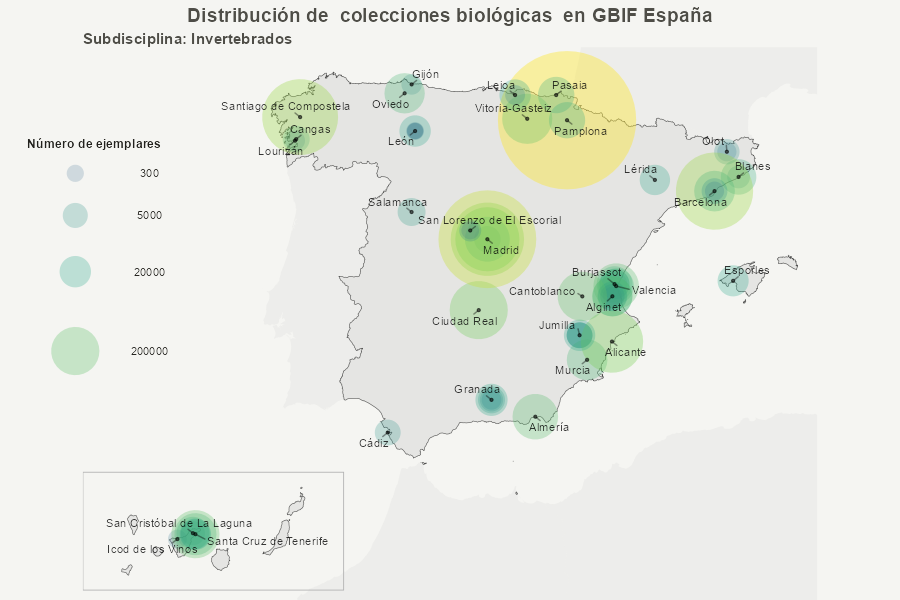
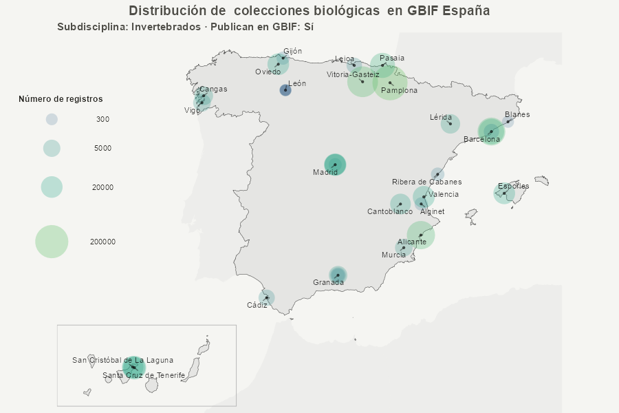
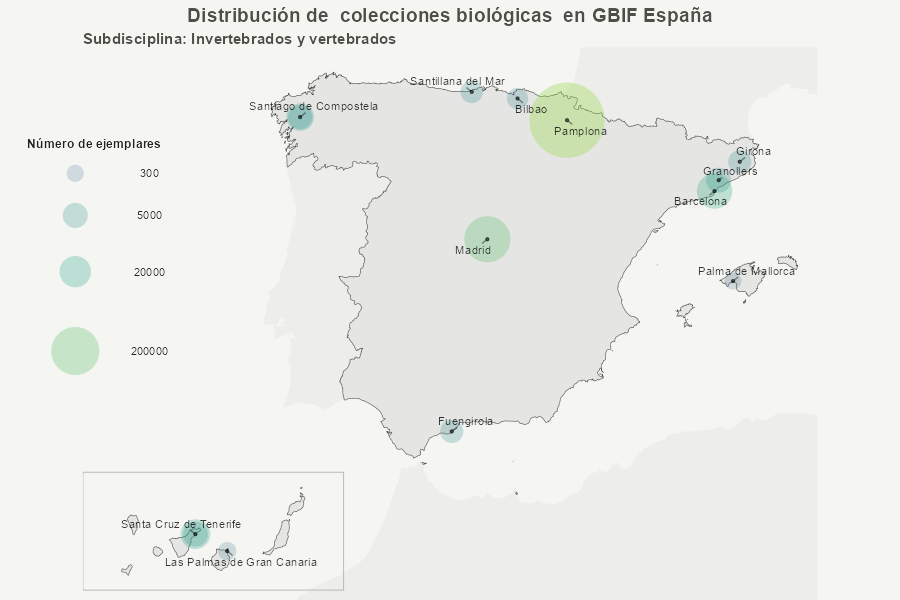
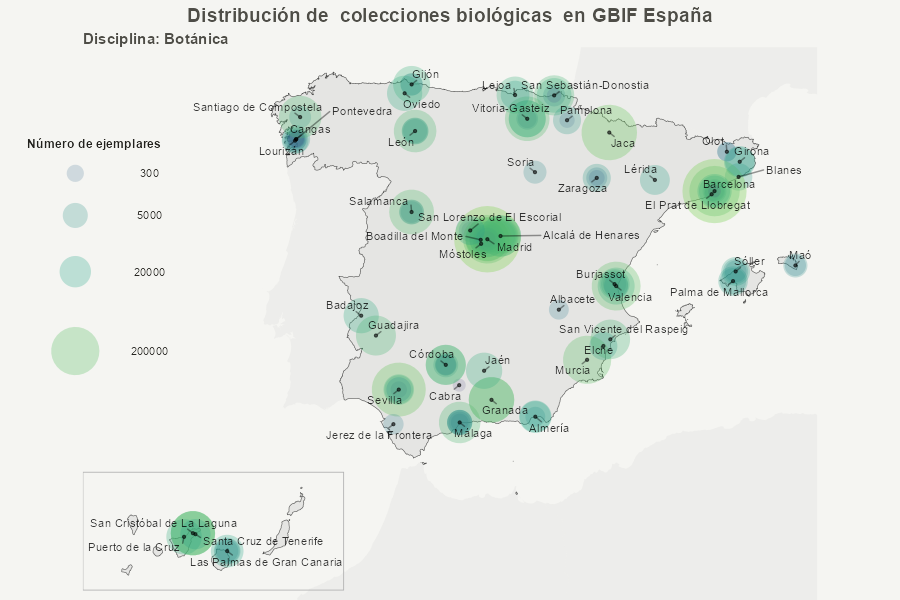
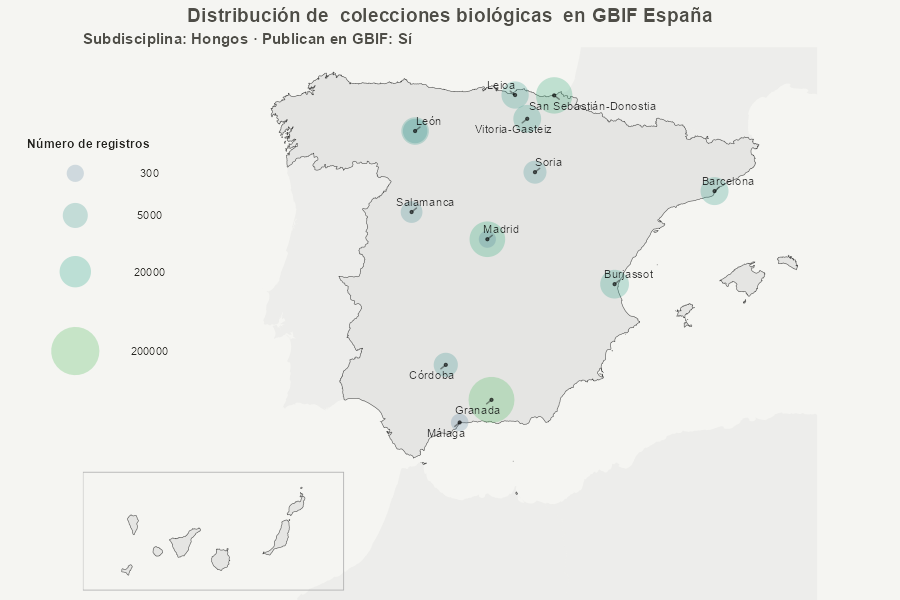
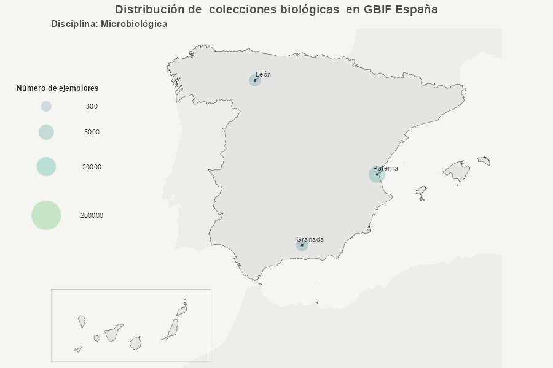
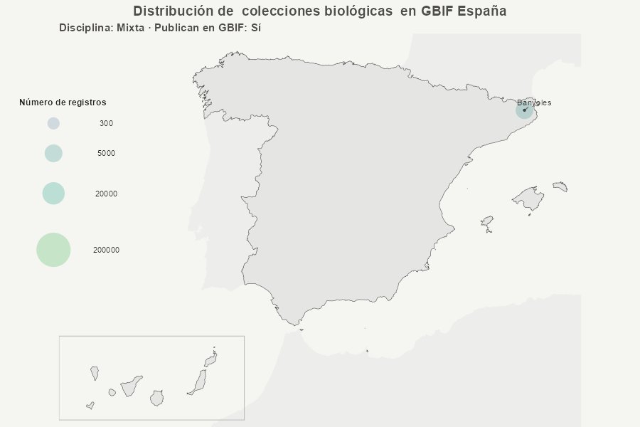

## Introducción

Esta vignette muestra distintos ejemplos de mapas generados con la función
`crear_mapa_simple()` del paquete **metagesToolkit**.

```r
# Función para la exploración y visualización de datos de colecciones y bases de datos.
mapa <- crear_mapa_simple()     # Genera una lista de R con 2 elementos

# Output
mapa$data_map                   # Muestra el data frame creado con los filtros aplicados
mapa$plot                       # Muestra el mapa creado con los filtros aplicados
```

El objetivo es ilustrar cómo se pueden visualizar colecciones biológicas
y bases de datos de biodiversidad en España mediante distintos parámetros
de la función, sin entrar en detalles de edición cartográfica avanzada.

## Datos de ejemplo

Para los ejemplos se utilizan datos extraídos del Registro de colecciones
mediante la función `extraer_colecciones_mapa()$data`.

```{r, echo=FALSE, message=FALSE, warning=FALSE}
library(DT)

dt <- readRDS("../inst/reports/data/mapas/mapa-total.rds")

cols_ocultar <- c("body_id", "url_institucion", "coleccion_url", "disciplina_id",
                  "condiciones_col", "longitude_adj", "latitude_adj")

datatable(
  dt,
  options = list(
    pageLength = 5,
    lengthMenu = c(5, 10, 25, 50),
    scrollX = TRUE,
    autoWidth = FALSE,
    columnDefs = list(
      list(
        visible = FALSE,
        targets = which(names(dt) %in% cols_ocultar)
      )
    )
  ),
  width = "100%"
)

```

## Mapa básico

Ejemplo mínimo de uso de `crear_mapa_simple()`, mostrando la distribución
espacial de todos los recursos del Registro.


## Mapa solo colecciones zoológicas

Ejemplo de uso de `crear_mapa_simple(tipo_coleccion = "coleccion", disciplina = "Zoo")`, mostrando la distribución
espacial de los recursos del Registro.


## Mapa solo colecciones zoológicas publicadoras

Ejemplo de uso de `crear_mapa_simple(tipo_coleccion = "coleccion", disciplina = "Zoo", publican = T)`, mostrando la distribución
espacial de los recursos del Registro.


## Mapa solo colecciones de invertebrados

Ejemplo de uso de `crear_mapa_simple(tipo_coleccion = "coleccion", subdisciplina = "Invertebrados")`, mostrando la distribución
espacial de los recursos del Registro.




## Mapa solo colecciones de invertebrados publicadoras

Ejemplo de uso de `crear_mapa_simple(tipo_coleccion = "coleccion", subdisciplina = "Invertebrados", publican = T)`, mostrando la distribución
espacial de los recursos del Registro.




## Mapa solo colecciones de vertebrados

Ejemplo de uso de `crear_mapa_simple(tipo_coleccion = "coleccion", subdisciplina = "Vertebrados")`, mostrando la distribución
espacial de los recursos del Registro.


## Mapa solo colecciones de vertebrados publicadoras

Ejemplo de uso de `crear_mapa_simple(tipo_coleccion = "coleccion", subdisciplina = "Vertebrados", publican = T)`, mostrando la distribución
espacial de los recursos del Registro.


## Mapa solo colecciones de invertebrados y vertebrados

Ejemplo de uso de `crear_mapa_simple(tipo_coleccion = "coleccion", subdisciplina = "Invertebrados y vertebrados")`, mostrando la distribución
espacial de los recursos del Registro.




## Mapa solo colecciones de invertebrados y vertebrados publicadoras

Ejemplo de uso de `crear_mapa_simple(tipo_coleccion = "coleccion", subdisciplina = "Invertebrados y vertebrados", publican = T)`, mostrando la distribución
espacial de los recursos del Registro.


## Mapa solo colecciones botánicas

Ejemplo de uso de `crear_mapa_simple(tipo_coleccion = "coleccion", disciplina = "Bot")`, mostrando la distribución
espacial de los recursos del Registro.




## Mapa solo colecciones botánicas publicadoras

Ejemplo de uso de `crear_mapa_simple(tipo_coleccion = "coleccion", disciplina = "Bot", publican = T)`, mostrando la distribución
espacial de los recursos del Registro.


## Mapa solo colecciones de plantas

Ejemplo de uso de `crear_mapa_simple(tipo_coleccion = "coleccion", subdisciplina = "Plant")`, mostrando la distribución
espacial de los recursos del Registro.


## Mapa solo colecciones de plantas publicadoras

Ejemplo de uso de `crear_mapa_simple(tipo_coleccion = "coleccion", subdisciplina = "Plant", publican = T)`, mostrando la distribución
espacial de los recursos del Registro.


## Mapa solo colecciones de algas

Ejemplo de uso de `crear_mapa_simple(tipo_coleccion = "coleccion", subdisciplina = "Algas")`, mostrando la distribución
espacial de los recursos del Registro.


## Mapa solo colecciones de algas publicadoras

Ejemplo de uso de `crear_mapa_simple(tipo_coleccion = "coleccion", subdisciplina = "Algas", publican = T)`, mostrando la distribución
espacial de los recursos del Registro.


## Mapa solo colecciones de hongos

Ejemplo de uso de `crear_mapa_simple(tipo_coleccion = "coleccion", subdisciplina = "Hong")`, mostrando la distribución
espacial de los recursos del Registro.


## Mapa solo colecciones de hongos publicadoras

Ejemplo de uso de `crear_mapa_simple(tipo_coleccion = "coleccion", subdisciplina = "Hong", publican = T)`, mostrando la distribución
espacial de los recursos del Registro.




## Mapa solo colecciones microbiológicas

Ejemplo de uso de `crear_mapa_simple(tipo_coleccion = "coleccion", disciplina = "Micro")`, mostrando la distribución
espacial de los recursos del Registro.




## Mapa solo colecciones microbiológicas publicadoras

Ejemplo de uso de `crear_mapa_simple(tipo_coleccion = "coleccion", disciplina = "Micro", publican = T)`, mostrando la distribución
espacial de los recursos del Registro.


## Mapa solo colecciones micológicas

Ejemplo de uso de `crear_mapa_simple(tipo_coleccion = "coleccion", disciplina = "Mico")`, mostrando la distribución
espacial de los recursos del Registro.


## Mapa solo colecciones micológicas publicadoras

Ejemplo de uso de `crear_mapa_simple(tipo_coleccion = "coleccion", disciplina = "Mico", publican = T)`, mostrando la distribución
espacial de los recursos del Registro.


## Mapa solo colecciones paleontológicas

Ejemplo de uso de `crear_mapa_simple(tipo_coleccion = "coleccion", disciplina = "Pale")`, mostrando la distribución
espacial de los recursos del Registro.


## Mapa solo colecciones paleontológicas publicadoras

Ejemplo de uso de `crear_mapa_simple(tipo_coleccion = "coleccion", disciplina = "Pale", publican = T)`, mostrando la distribución
espacial de los recursos del Registro.


## Mapa solo colecciones mixtas

Ejemplo de uso de `crear_mapa_simple(tipo_coleccion = "coleccion", disciplina = "Mix")`, mostrando la distribución
espacial de los recursos del Registro.


## Mapa solo colecciones mixtas publicadoras

Ejemplo de uso de `crear_mapa_simple(tipo_coleccion = "coleccion", disciplina = "Mix", publican = T)`, mostrando la distribución
espacial de los recursos del Registro.




## Mapa facetado de bases de datos por disciplina (publicadoras)

Ejemplo de uso de `crear_mapa_simple(tipo_coleccion = "base de datos", facet = "disciplina_def", publican = T)`, mostrando la distribución
espacial de los recursos del Registro, facetada por disciplina.


## Mapa facetado de bases de datos por disciplina (no publicadoras)

Ejemplo de uso de `crear_mapa_simple(tipo_coleccion = "base de datos", facet = "disciplina_def", publican = F)`, mostrando la distribución espacial de los recursos del Registro, facetada por disciplina. 

(*Si no hay imagen es porque no hay datos para esta categoría*)


## Acceso a los datos usados en el mapa

La función `crear_mapa_simple()` devuelve una lista que incluye los datos
filtrados utilizados para generar el mapa, lo que permite reutilizarlos
en tablas o análisis posteriores.

```{r datos-filtrados, eval = FALSE}
res <- crear_mapa_simple(disciplina = "Zoo")
head(res$data)
```

## Notas técnicas

- `crear_mapa_simple()` devuelve una lista con al menos:
  - `plot`: objeto `ggplot2`
  - `data`: datos filtrados utilizados en el mapa
- El mapa base de España se genera automáticamente y trata de forma
  específica el desplazamiento de Canarias.


## Referencias

- Documentación de la función: `?crear_mapa_simple`
- Sitio pkgdown del paquete **metagesToolkit**
